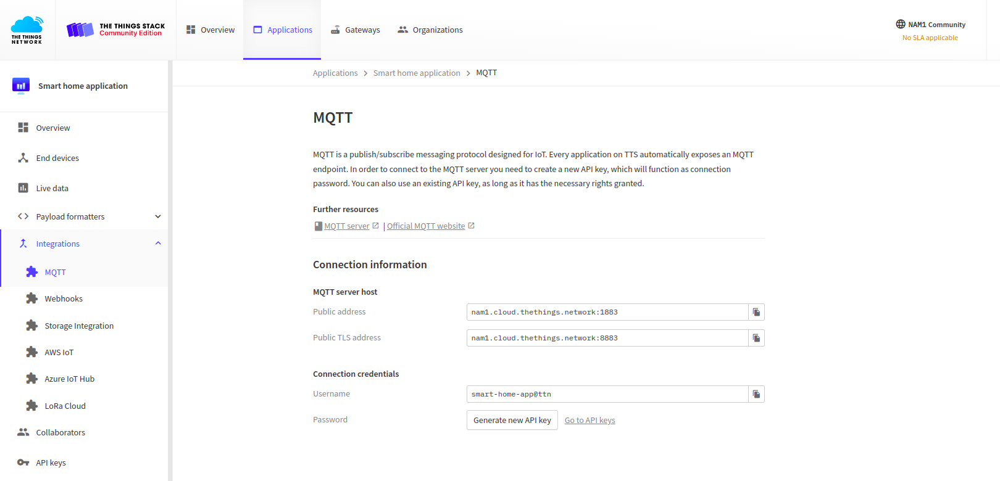
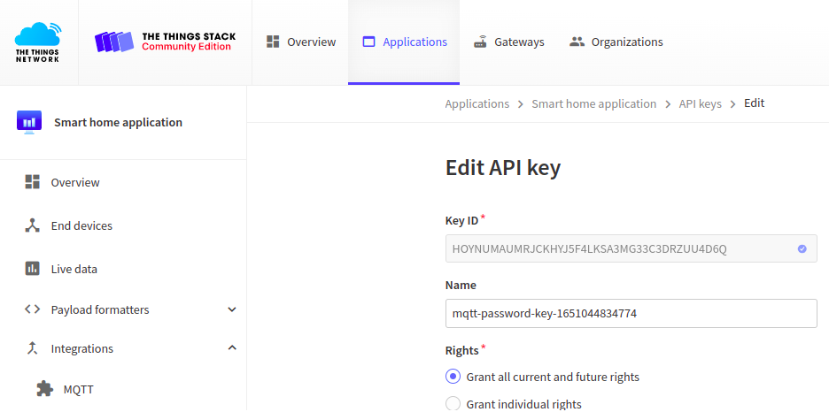
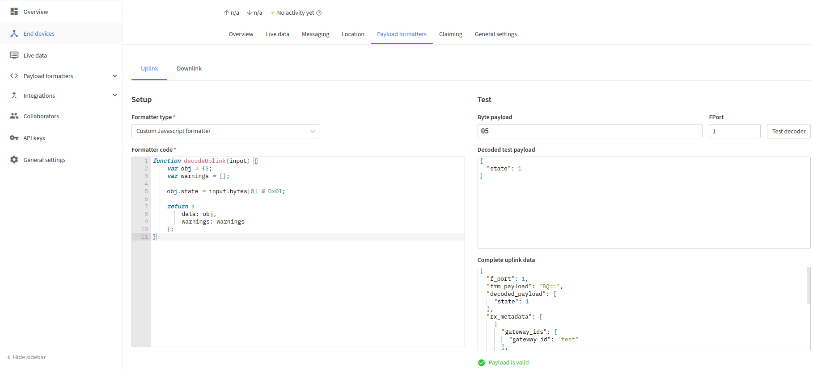
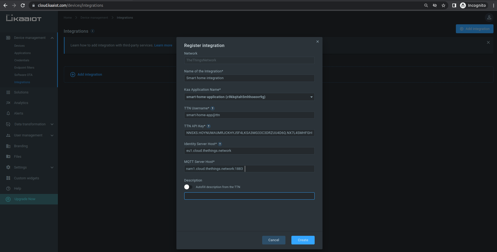
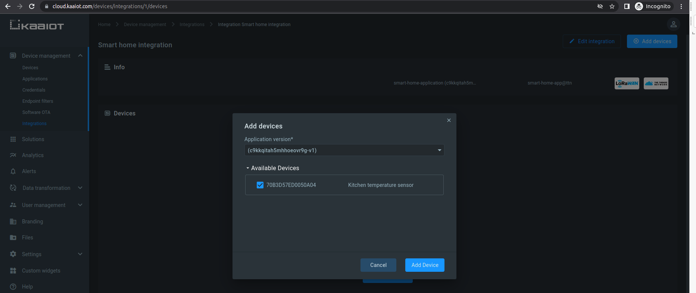
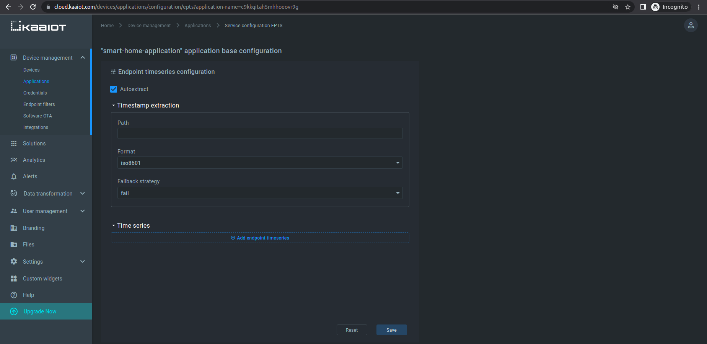
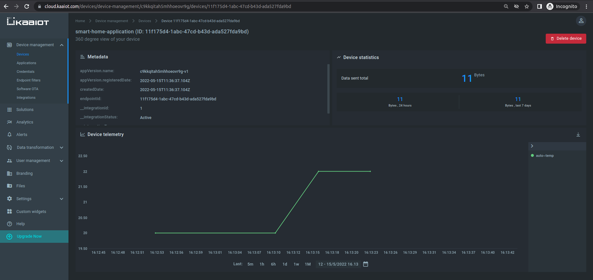




* TOC
{:toc}


## Overview

In this tutorial, we will look at how to integrate the LoRa device with the Kaa platform using [The Things Network (TTN)][the-things-network] as a LoRaWAN provider.
You will learn how to create a digital twin of your LoRa device, connect the device to Kaa, submit some telemetry and view it in the Kaa web interface.
For that purpose, we will use [The Things Stack Community Edition][the-things-stack-community-edition].


## Terms and concepts

### The Things Stack

The Things Stack is an opensource LoRaWAN Network Server which is the critical component for any LoRaWAN solution.

The Things Stack can be used in several ways. 
You can use The Things Stack Open Source and manage the open source version yourself. 
You can freely use [The Things Stack Community Edition][the-things-stack-community-edition] (a.k.a. **The Things Network**) for testing and evaluation purposes.
For commercial deployments you can team up with The Things Industries for an SLA-backed, fully managed service and use The Things Stack (Dedicated) Cloud.

### LoRaWAN

LoRaWAN is a wide area network protocol, which is built upon LoRa modulation technique, providing long range, low power and secure characteristics that are ideal for telemetry use cases.


## Prerequisites

1. You have an account in [The Things Network][the-things-network]
2. You have an account in [Kaa cloud][Kaa cloud]

## Playbook


### Connect your LoRa device

Primarily we have to create a new application in our The Things Network account.

> NOTE: Application ID is unique and can't be repeated across different accounts.
{:.note}


Next, in the MQTT integration, we need to generate an API key to access this application. 

**Attention**: Don't forget to copy and save the created API key.



Then set the rights for this key by selecting **Grand all current and future rights**.

This level of access is required by the Kaa platform in order to be able to query The Things Network for application parameters and information on registered devices in that application.



After that, we need to configure the uplink payload formatter by selecting **Custom Javascript formatter**.



Now we can start setting up the test LoRa device. 
Go to the **Manually** tab and setup the following parameters.
- **Frequency plan**
- **LoRaWaN version**
- Generate **DevEUI**
- Fill with zeros **AppEUI**
- Generate **AppKey**


To distinguish that device, we name it as "Kitchen temperature sensor".


After that, we can go to the [Kaa cloud][Kaa cloud] and continue setting up our integration.

### Application integration creation

Primarily we should create an **application integration**, i.e. integration between Kaa application and TTN application.

For that at first we have to create a [Kaa application][application] corresponding to the previously created TTN application.

Let's name it "smart-home-application".


Next, we have to create the application version by clicking on the **plus** button.


Now, when the application and its version are created, create the integration between Kaa and TTN applications.
For that, go to the **Device management**, **Integrations**, and click the **Add integration** button.



We have to fill the next fields:

- **TTN username** - the *Username* of MQTT Integration for the current TTN application.
  
  The username must have the next format {application ID}@{tenant ID}
  
  Tenant ID for [The Things Network Community Edition][the-things-stack-community-edition] is `ttn`. 
  More detailed about the TTN tenant ID is [here][ttn-note-on-using-the-tenant-id].

- **TTN API key** - the *API Key* of MQTT Integration for the current TTN application.

  **Grant all current and future rights** must be selected for this API Key. 
  More details about API Key creation is [here][ttn-api-key-creation].

- **Identity Server Host** - the TTN Identity Server host address.

  The Identity Server APIs are only available in the `eu1` cluster. 

  Default values: 
  - `eu1.cloud.thethings.network` for [The Things Network Community Edition][the-things-stack-community-edition].
  - `{tenant}.au1.cloud.thethings.industries` for [The Things Network Cloud deployment][the-things-stack-cloud-hosted], where {tenant} is your Tenant ID

- **MQTT Server Host** - the *Public address* of MQTT Integration for the current TTN application.

The values of the **TTN username**, **TTN API key** and **MQTT Server Host** fields locate under the MQTT integration menu.


Press the **Save** button to create the integration between Kaa and TTN applications.
### Device integration creation

After application integration is created, it's possible to create **device integrations**, i.e. mappings between The Things Network devices and Kaa [endpoints][endpoint].

Go to the created application integration and create device integration choosing the application version and TTN device that you want to integrate.



As we can see, the **device integration** has been created and appeared in the **Devices** list.


Going to the **Device management** dashboard, you will find the relevant endpoint that was automatically created during the device integration registration.
All incoming data from the TTN device will be ingested under that endpoint.


### Data visualization

Next, we want to get some test data from The Things Network device and visualize it on Kaa UI.

Before visualization, we have to set up our Kaa application.
#### Enable time series auto-extraction

Edit the application configuration for the [Endpoint Time Series service (EPTS)][EPTS].
EPTS is a Kaa platform component responsible for transforming raw [data samples][data-sample] into well-structured time series.
It also stores the time series data and provides access to API for other services, including the [Web Dashboard][WD].

Enable the [time series auto-extraction][EPTS time series auto extraction] from data samples for the previously specified Kaa application.



With this function enabled, Kaa will automatically create a time series for each **numeric** field that it encounters at the root of data samples submitted by your endpoints.
You will then be able to view these time series in the Kaa UI, with no extra configuration required.


#### Visualization

Go to the device details page of the recently created endpoint by clicking on the corresponding row in the device table on the **Devices** dashboard.
We could see the data from our The Things Network device on the **Device telemetry** widget.
But we don't have any data yet, so the "NO DATA FOUND" message is displayed.


To simulate sending some test data from the LoRa device, go to The Things Network to the **Messaging** of the corresponding **End device**.
The **Payload** field allows us to simulate uplink data from the LoRa device.

Let's simulate that the LoRa device sends temperature measurements. For example:

```json
{"temperature":20}
```

As we use **Custom Javascript formatter**, our JSON data is a byte array.
The resulting byte array is a byte representation of JSON message.
So you can use any **text to ASCII codes** converter.

**Attention**: Resulting ASCII codes must be in HEX form.

In our case the  byte array to send is:

```text
7B 22 74 65 6D 70 22 3A 32 30 7D
```


After four messages have been sent, we can see their visualization inside the Kaa platform:



Congratulations, you have successfully sent messages from the test The Things Network device and visualized it in the Kaa UI!


## Next steps

- Complete the [**Getting Started tutorials cycle**][getting started tutorials] with short tutorials on the main Kaa features.
- Join the discussion at our [community chat][Kaa user chat] and share feedback!
