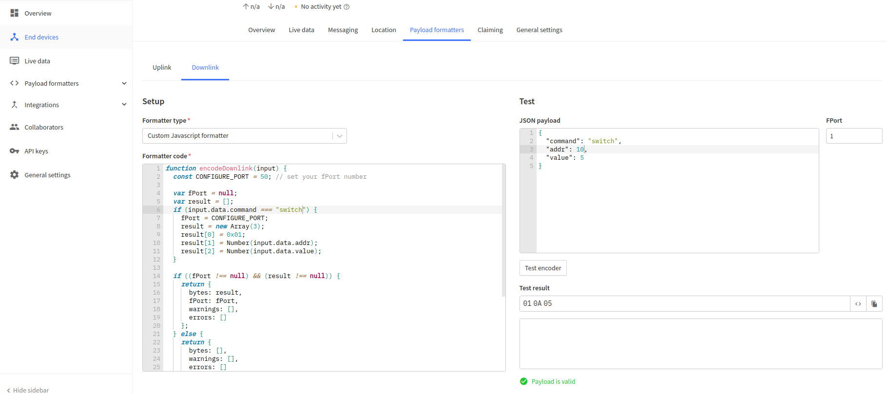
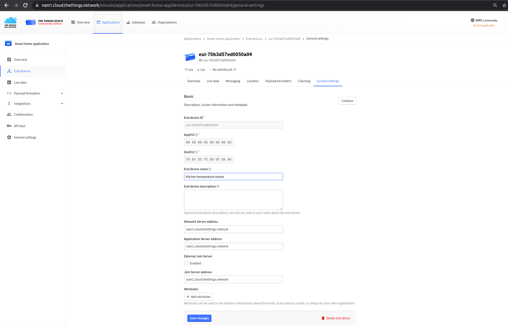
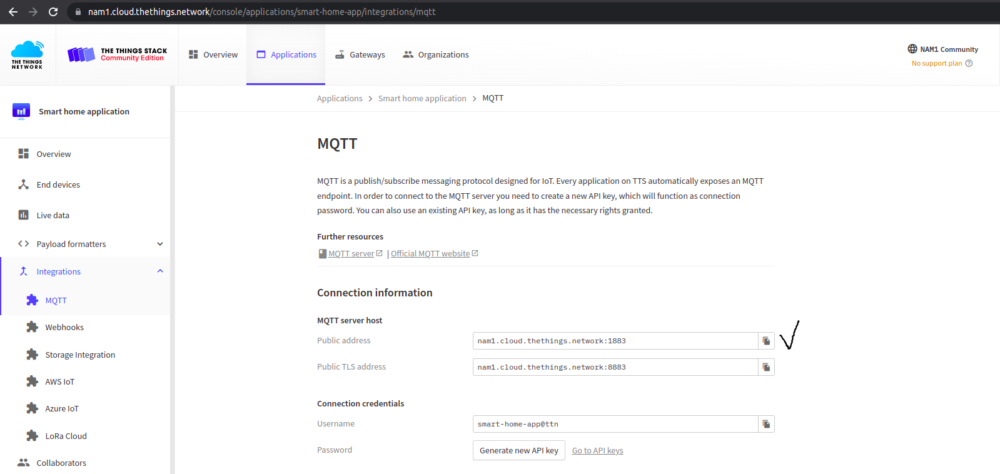




* TOC
{:toc}


## Overview

In this tutorial, we will look at how to integrate a LoRa device with the Kaa IoT platform using [The Things Network (TTN)][the-things-network] as a LoRaWAN provider.
You will learn how to create a digital twin of your LoRa device, connect the device to Kaa, submit some telemetry and view it in the Kaa web interface.
For that purpose, we will use [The Things Stack Community Edition][the-things-stack-community-edition].


## Terms and concepts


### The Things Stack

The Things Stack is an opensource LoRaWAN Network Server which is a critical component for any LoRaWAN solution.

The Things Stack can be used in several ways.
You can use The Things Stack Open Source and manage the open source version yourself.
You can also freely use [The Things Stack Community Edition][the-things-stack-community-edition] (a.k.a. **The Things Network**) for testing and evaluation purposes.
For commercial deployments you can team up with The Things Industries for an SLA-backed, fully managed service and use The Things Stack (Dedicated) Cloud.


### LoRaWAN

LoRaWAN is a wide area network protocol, which is built upon LoRa modulation technique, providing long range, low power and secure characteristics that are ideal for telemetry use cases.


## Prerequisites

1. You have an account in [The Things Network][the-things-network]
2. You have an account in the [Kaa cloud][Kaa cloud]


## Playbook


### Provision your LoRa device

First things first, let's create a new application in our The Things Network account.

> NOTE: Application ID is unique and can't be reused across different accounts.
{:.note}


Next, in the MQTT integration, we need to generate an API key to access this application.

> Remember to copy and save the created API key.
{:.important}


Then set the rights for this key by selecting "Grand all current and future rights".
This level of access is required by the Kaa platform in order to be able to query The Things Network for application parameters and registered devices.

More details about TTN API Keys [here][ttn-api-key-creation].


Also, we need to configure the uplink payload formatter.

> NOTE: Pay attention that the Kaa platform works with the data represented in JSON format.
{:.note}

To do it we have to switch to the "Custom Javascript formatter" and remake a code to convert the binary data received from the device to the JSON message that will be sent to the Kaa platform.

It is preferable to check that the payload formatter code is correct by pasting the device payload into the *Byte payload* input field of the Test form and pressing the *Test decoder* button.
If the formatter is correct the *Decoded test payload* field will contain the result JSON.


If we also want to use LoRaWAN downlink commands we have to configure the Downlink formatter.



An example of the downlink formatter code:

```js
function encodeDownlink(input) {
	const CONFIGURE_PORT = 50; // set your fPort number

	var fPort = null;
	var result = [];
	if (input.data.command === "switch") {
		fPort = CONFIGURE_PORT;
		result = new Array(3);
		result[0] = 0x01;
		result[1] = Number(input.data.addr);
		result[2] = Number(input.data.value);
	}

	if ((fPort !== null) && (result !== null)) {
	    return {
			bytes: result,
			fPort: fPort,
			warnings: [],
			errors: []
		};
	} else {
		return {
			bytes: [],
			warnings: [],
			errors: []
		};
	}
}

function decodeDownlink(input) {
	return {
		data: {
			bytes: input.bytes
		},
		warnings: [],
		errors: []
	}
}
```

We can similarly test the formatter code as we did it for the uplink formatter.

Now we can start setting up the test LoRa device.
Go to the "Manually" tab and set up the following parameters:

* Frequency plan
* LoRaWaN version
* Generate DevEUI
* Fill with zeros AppEUI
* Generate AppKey

For simplicity, in this tutorial we will simulate telemetry from the device, so the first two values are not critical.
In a real hardware deployment we advise that you review the applicable country regulations and the hardware specifications to apply correct settings.
Also refer to the TTN documentation on [frequency plans][ttn-frequency-plans] and [frequencies by country][ttn-frequencies-by-country].


To distinguish this device, let's call it "Kitchen temperature sensor".



Now we can go to the [Kaa cloud][Kaa cloud] and continue setting up our integration.


### Application integration

To start with, we should create an **application integration** between the Kaa and TTN applications.
To do so, let us first create a new [Kaa application][application] to match the previously created TTN application.
Go to the "Device management" / "Applications" section in the Kaa web dashboard and add an application.
Let's call it "smart-home-application".


Next, we have to create the application version:


Now, when the application and its version are created, let us set up integration between Kaa and TTN applications.
For that, go to the "Device management" / "Integrations", and click the "Add integration" button.


We have to fill in the following fields:

* **TTN username** of MQTT integration for the previously created TTN application.

  The TTN username must have the following format: `<TTN application ID>@<tenant ID>`.

  Tenant ID for [The Things Network Community Edition][the-things-stack-community-edition] is `ttn`.
  More details about TTN tenant IDs [here][ttn-note-on-using-the-tenant-id].

* **TTN API key** is your previously generated TTN MQTT integration API Key for the current application.

* **Identity Server Host** address.

  The Identity Server APIs are only available in the `eu1` cluster.

  The default values are:
  * `eu1.cloud.thethings.network` for [The Things Network Community Edition][the-things-stack-community-edition]
  * `<tenant>.eu1.cloud.thethings.industries` for [The Things Network Cloud deployment][the-things-stack-cloud-hosted], where `<tenant>` is your Tenant ID

* **MQTT Server Host** is the "Public address" of TTN MQTT integration.

You can look up values of the "TTN username", "TTN API key" and "MQTT Server Host" fields under the TTN MQTT integration menu.



Finally, press the "Save" button to create the integration between Kaa and TTN applications.


### Device mapping

Now that the application integration is done, you can create mappings between TTN devices and Kaa [endpoints][endpoint].

Go to the created application integration and create device mappings choosing the application version and TTN device that you want to map.


As you can see, a mapping is created and appears under the Devices list:


If you go to the "Device management" dashboard you can now see an endpoint that was created automatically.
All incoming data from the TTN device will be ingested under that endpoint.


### Data visualization

Now let's get some test data from The Things Network device and visualize it on the Kaa UI.

To do so, we have to set up our Kaa application.


#### Enable time series auto-extraction

Edit the application configuration for the [Endpoint Time Series service (EPTS)][EPTS].
EPTS is a Kaa platform component responsible for transforming raw [data samples][data-sample] into well-structured time series.
It also stores the time series data and provides access to API for other services, including the [Web Dashboard][WD].

Enable the [time series auto-extraction][EPTS time series auto extraction] from data samples for the previously specified Kaa application.


With this function enabled, Kaa will automatically create a time series for each numeric field that it encounters at the root of data samples submitted by your endpoints.
You will then be able to view these time series in the Kaa UI, with no extra configuration required.


#### Visualization

Go to the device details page of the recently created endpoint by clicking on the corresponding row in the device table on the "Devices" dashboard.
Telemetry data from our TTN device will appear on the "Device telemetry" widget.
But we don't have any data yet, so the "NO DATA FOUND" message is displayed.


To simulate sending some test data from the LoRa device, go to the "Messaging" tab of the corresponding "End device".
The "Payload" field allows us to simulate uplink data from the LoRa device.

Let's simulate that the device sends temperature measurements.
For example:

```json
{"temp":20}
```

As we've set up a "Custom Javascript formatter", our JSON data is a byte array.
The resulting byte array is a byte representation of JSON message.
You can use any text to ASCII codes converter.

> Resulting ASCII codes must be in HEX form.
{:.important}

In our case the byte array to send is:

```text
7B 22 74 65 6D 70 22 3A 32 30 7D
```


After a few sent messages you should see the telemetry data visualized in the Kaa web dashboard:


Congratulations, you have successfully sent messages from a TTN device and visualized it in the Kaa UI!


## Next steps

* Complete the [**Getting Started tutorials cycle**][getting started tutorials] with short tutorials on the main Kaa features.
* Join the discussion at our [community chat][Kaa user chat] and share feedback!


[the-things-stack-community-edition]: https://www.thethingsindustries.com/docs/getting-started/console/#the-things-stack-community-edition
[the-things-stack-cloud-hosted]:      https://www.thethingsindustries.com/docs/getting-started/cloud-hosted
[ttn-note-on-using-the-tenant-id]:    https://www.thethingsindustries.com/docs/integrations/mqtt/#note-on-using-the-tenant-id
[ttn-api-key-creation]:               https://www.thethingsindustries.com/docs/integrations/mqtt/#creating-an-api-key
[ttn-frequency-plans]:                https://www.thethingsnetwork.org/docs/lorawan/frequency-plans
[ttn-frequencies-by-country]:         https://www.thethingsnetwork.org/docs/lorawan/frequencies-by-country
