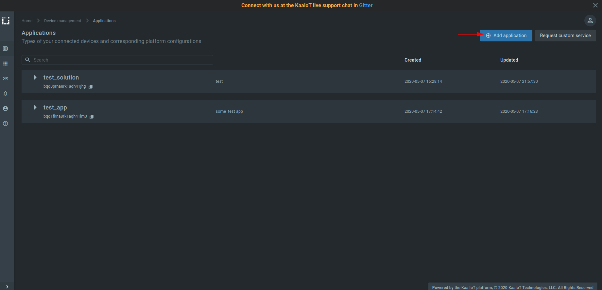
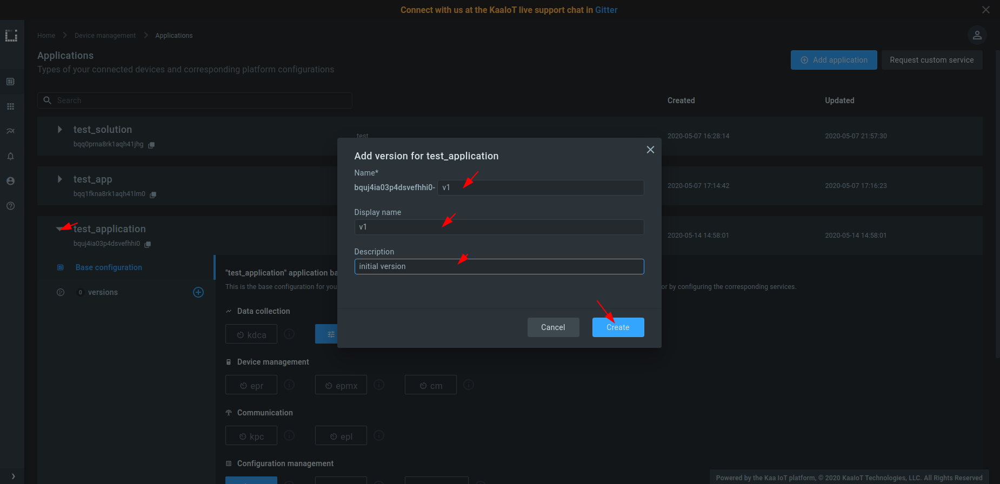
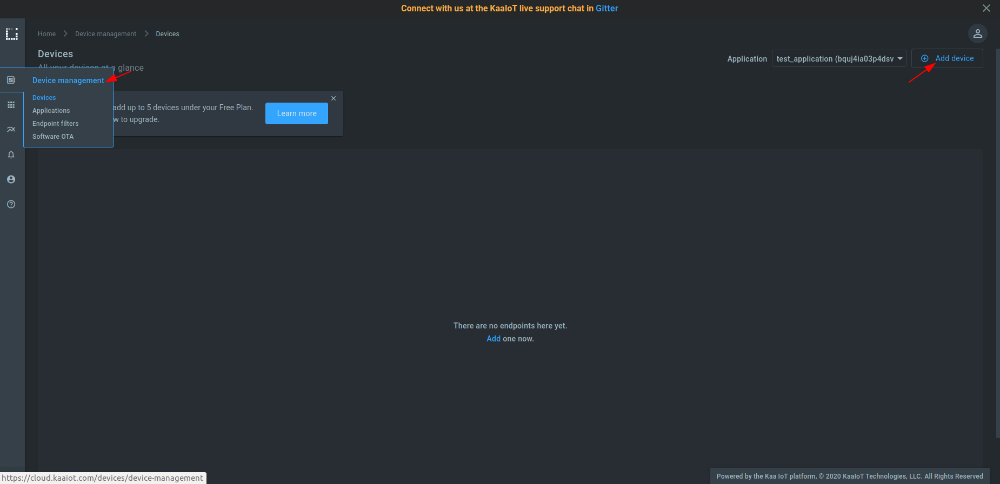
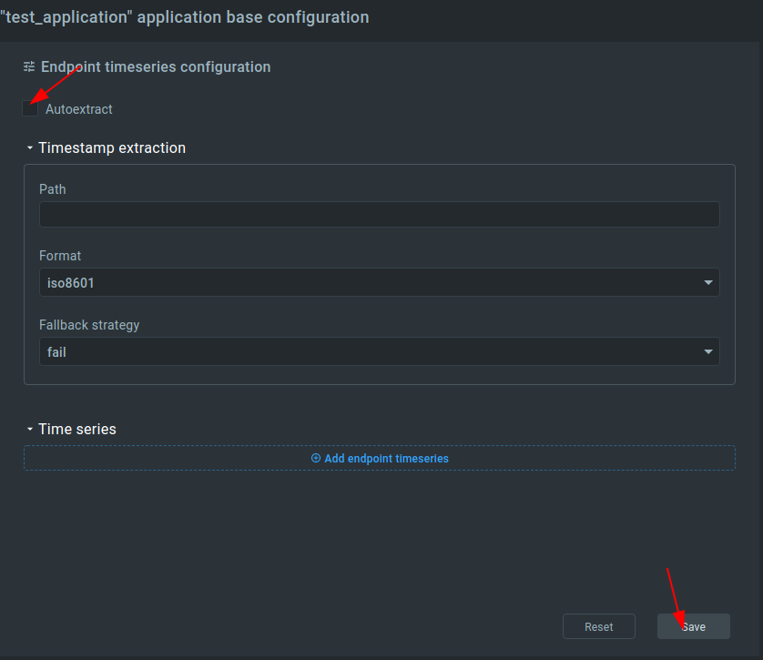
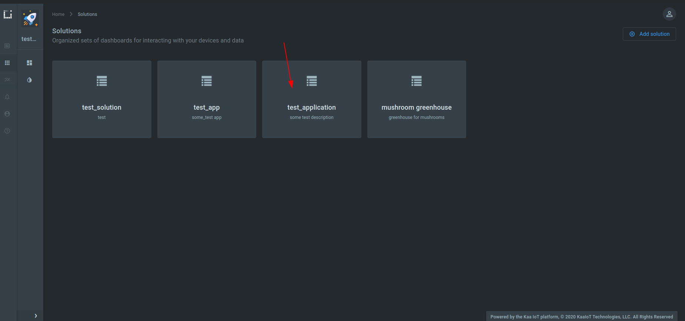
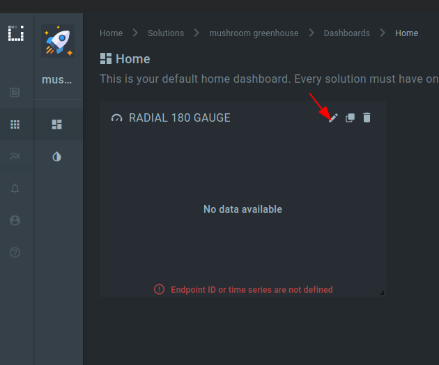
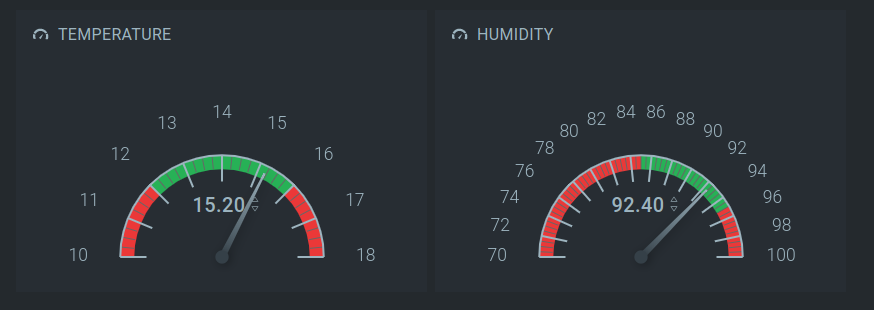
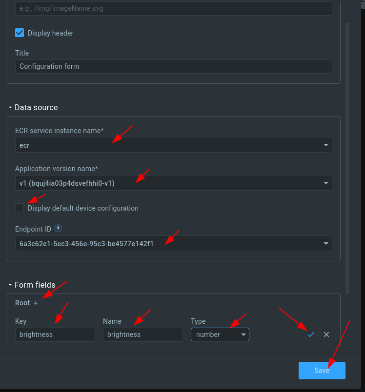
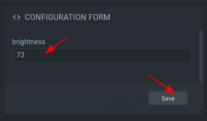




* TOC
{:toc}

In this tutorial, we will look at how to connect an [Arduino MKR-1010][MKR-1010] board with [MKR-ENV][MKR-ENV-Shield] shield to the Kaa platform using the default MQTT-based protocol.
You will learn how to create a digital twin of your device and connect it to the platform, collect device telemetry, and view telemetry in the Kaa web interface.

​Here is what we will have in the result:


## Overview

We will simulate a greenhouse solution, which will allow us to monitor temperature, humidity, and lighting levels.
Our MKR-1010 will represent an [endpoint][endpoint] in the Kaa platform and report all sensor data.
Also, we will interact with the Kaa [Web Dashboard][dashboard] to create a digital twin of the [Arduino MKR-1010][MKR-1010] and view telemetry data.

> NOTE: [MKR-ENV][MKR-ENV-Shield] shield has more than temperature, humidity, and lighting; additionally, it has an ultraviolet(A and B wavelengths) and atmosphere pressure sensors, the data from which will be also reported in our solution.
{:.note}


## Playbook

### Create Kaa Cloud account

For the tutorial completion, we will need an account in the Kaa Cloud.
To obtain it, register on [kaaproject.org][kaaproject.org].

Then go to the [free trial page][Kaa cloud free trial] and click "Go to cloud". A Kaa Cloud account will be automatically created for you.


### Create application

Before creating any device, you need to create at least one "Application"

**1**. Go to the "Applications" dashboard in your [Kaa Cloud account][Kaa cloud].


**2**. Click "Add application".



**3**. Fill out the "Display name" and "Description" fields; then click "Create".


**4**. Create at least one version of your application. 
For that, expand the created application, click "Add version", fill out the fields, and click "Create".




### Connect your device

**1**. Go to the "Device management" dashboard and click "Add device" to register a digital twin for your device. 
It's called an "[endpoint][endpoint]" in Kaa.



**2**. Choose the [application version][application] from the drop-down menu.
You can bump application versions in the application administration page as your devices evolve.
Choose and enter an [endpoint token][endpoint-token].

> NOTE: Tokens are used for device identification in communication with the Kaa platform.
They are non-empty strings that do not contain the following reserved characters: `+`, `#`, `/`, and `.`.
A token will be autogenerated if you leave this field blank.
{:.note}

> NOTE: Metadata is simply key-value attributes that provide certain information about a device, e.g. its location, owner, customer, model, etc.
{:.note}

Click "Create".


**3**. Copy and save the endpoint token in some file because **you won't be able to see it again in the future**.
We will use the token in a bit to connect [Arduino MKR-1010][MKR-1010].


**4**. Open the [sketch_MKR_1010_KAA_integration_tutorial.ino][code-url] file with the Arduino IDE and fill out the connection parameters:

```
const char* ssid = "";          // your WiFi network SSID
const char* password = "";      // your WiFi network password
const String TOKEN = "";        // the endpoint token from the previous step
const String APP_VERSION = "";  // the application version name you are working with
```

**5**. Upload the `sketch_MKR_1010_KAA_integration_tutorial.ino` file to your MKR-1010 board.

Now the device can send telemetry data with the temperature, humidity, pressure, illuminance, ultraviolet type A, and ultraviolet type B values.
The data payload is a UTF-8 encoded JSON array as below.

```json
[
  {
    "temperature":26.86638,
    "humidity":47.11707,
    "pressure":99.8,
    "illuminance":17.74194,
    "uva":3,
    "uvb":2
  }
]
```

More details about the payload format are [here][data collection].


### Visualize data from the device

Before visualizing the data, you should edit application configuration for the [Endpoint Time Series service (EPTS)][EPTS].
EPTS is the Kaa platform's component that is responsible for transforming raw [data samples][data-sample] into well-structured time series.
It also stores the time series data and provides access API for other services, including the [Web Dashboard][dashboard].

**1**. Go to the "Applications" dashboard


**2**. Expand your application and click on [EPTS][EPTS] 


**3**. Enable the [time series auto-extraction][EPTS time series auto extraction] from data samples.




That's it, now we can visualize the data.

Each device has a built-in visualization (telemetry chart) widget, which we can use to check incoming data from the MKR-1010 board. 

Go to the device details page of the recently created endpoint (by clicking on the corresponding row in the device table).
See the data from your MKR-1010 board on the `DEVICE TELEMETRY` widget.


### Customize vizualizations

The Kaa platform has many widgets to visualize the data. Users can choose among those widgets to organize their own custom dashboards.

Let's create a dashboard for a "mushroom greenhouse". This type of greenhouse requires tracking of temperature and humidity data.

**1**. Go to "Solutions" section and select the created solution.



**2**. Click "Edit".


**3**. Set "mushroom greenhouse" for the "Title" field and click "Update". 


**4**. Select the "mushroom greenhouse" dashboard.

**5**. Click on "Edit mode".


**6**. Click on "Add widget".


**7**. Select "Gauges" -> "Radial 180" widget.

**8**. Click on the "Edit" button on the just added widget (RADIAL 180 GAUGE).



**9**. Fill out the header form. 


**10**. Fill out the "Data source" form 


**11**. Fill out the "Value ranges" form.


**12**. Select the endpoint ID. 


**13**. Click "Save" to save changes. 

**14**. Click "Publish changes" to save and publish changes.


Our widget for temperature tracking is ready.

> NOTE: A widget for humidity tracking can be created in a similar way, so it will be skipped in this tutorial.
{:.note}

Custom visualization for a "mushroom" greenhouse is done.




### Manage device settings

Kaa allows you to not only collect (observe) device data but also interact with remote devices by using commands or configurations. 
We will use the configuration functionality provided by Kaa to maintain optimal light intensity inside our greenhouse. 
Our Arduino setup has a light sensor, which monitors ambient light intensity in lux, and a LED module for compensating a potential lack of sunlight. 
We will create a widget that sets the target light intensity level for our Arduino device so that there's always enough light in our greenhouse no matter what time of the day.

**1**. Click on "Edit mode".


**2**. Click on "Add widget".


**3**. Select "Configuration management" -> "Configuration form" widget.

**4**. Click “edit” in the right upper corner of the just added widget. The widget's configuration form will open.

**5**. Fill out the form.



**6**. Click “Save” to save changes.

**7**. Set the desired light intensity value (in lux), and click "Save".



Now the platform will send a new configuration to the device and the device will maintain the light intensity on the desired level.


Congratulations, you have connected, set up, and visualized data from your [Arduino MKR-1010][MKR-1010] board with [MKR-ENV][MKR-ENV-Shield] shield in Kaa Cloud!

Here's a short video of how this setup works.

<div align="center">
  <iframe width="640" height="385" src="https://www.youtube.com/embed/YKK5XXFX1x0?rel=0" frameborder="0"
          allow="accelerometer; autoplay; encrypted-media; gyroscope; picture-in-picture" allowfullscreen></iframe>
</div>


## Resources

* All tutorial resources are located on [GitHub][code-url].


## Next steps

- Join the discussion at our [community chat][Kaa user chat] and share feedback!
- Now that you have some Kaa experience under your belt, check out the [Kaa IoT Cloud and Kaa 1.1 webinar][webinar Kaa IoT Cloud and Kaa 1.1] to implement something more complicated.
- [Data Analytics and Notifications webinar][webinar Data Analytics and Notifications] based on Arduino compatible(ESP8266) smart socket.
- [Device management][identity] - find out more about the device management feature.


[code-url]:                 https://github.com/kaaproject/kaa/tree/master/doc/Tutorials/connect-arduino-mkr-1010-to-kaa-platform/attach/code
[arduino-ide]:              https://www.arduino.cc/en/Main/Software
[MKR-1010]:                 https://www.arduino.cc/en/Guide/MKRWiFi1010
[MKR-ENV-Shield]:           https://www.arduino.cc/en/Guide/MKRENVShield
[Kaa cloud free trial]:     https://www.kaaproject.org/free-trial
[kaaproject.org]:      https://www.kaaproject.org

