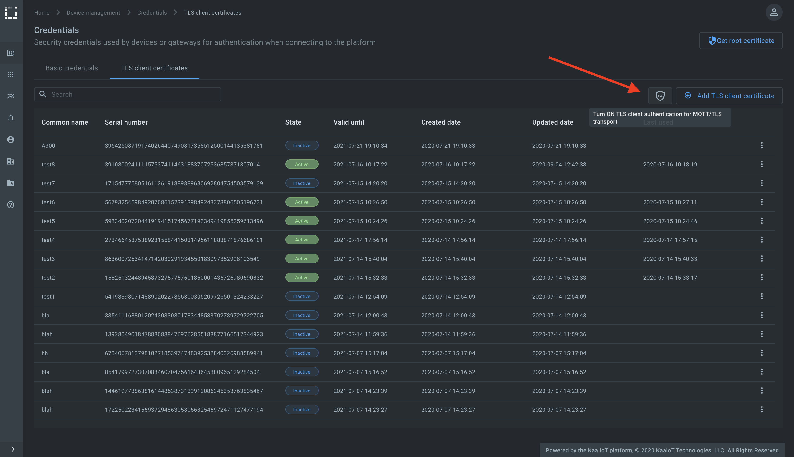
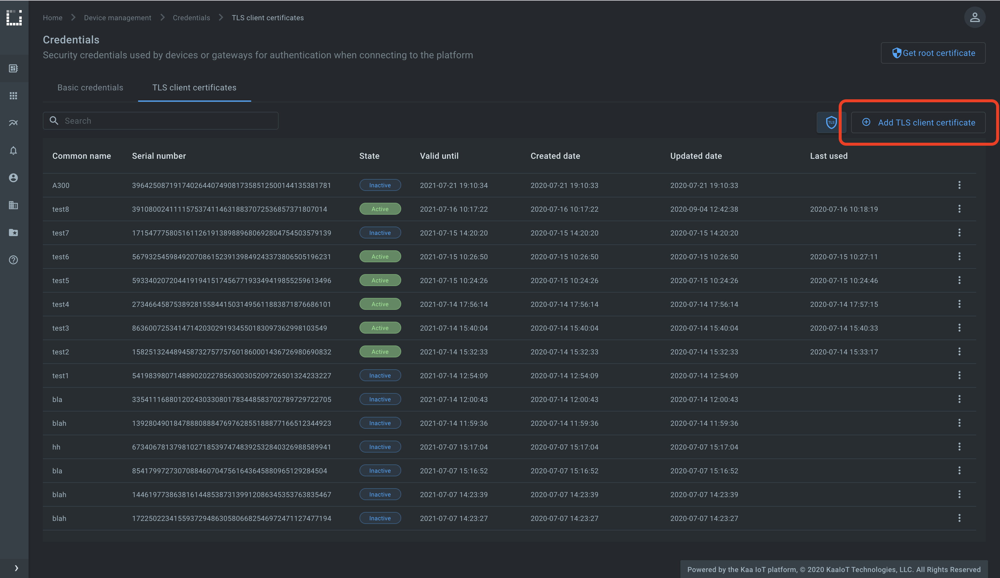
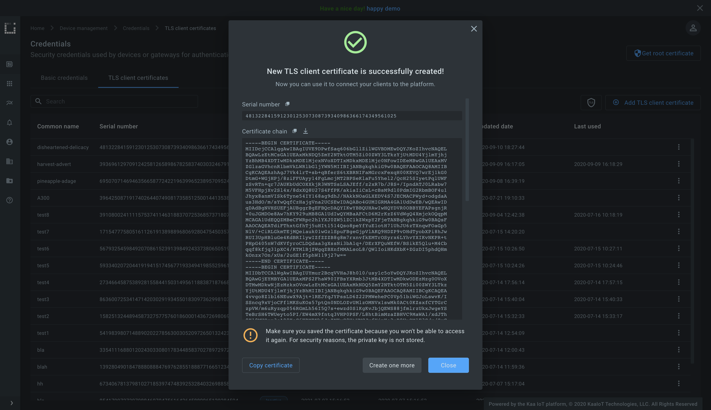
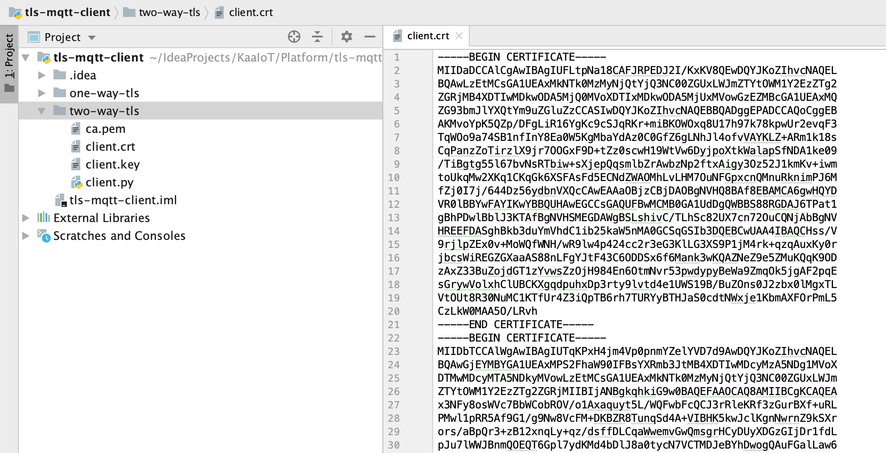




* TOC
{:toc}

Based on the [*Kaa v1.2*][whats new in 1.2].

Time to complete: *10 min*.


<!-- TODO: add video link

<div align="center">
  <iframe width="640" height="385" src="https://www.youtube.com/" frameborder="0"
          allow="accelerometer; autoplay; encrypted-media; gyroscope; picture-in-picture" allowfullscreen></iframe>
</div> --->


## Overview

Welcome to the sixth tutorial in the Kaa getting started guide!

From this tutorial you will learn some additional concepts of the Kaa platform and discover how to:

* communicate with the platform over **one-way** and **two-way** (mutual) MQTT over SSL/TLS
* **authenticate [client][client]** (or device) using X.509 certificate
* **suspend/revoke/reactivate** client X.509 certificate


<a id="one-way-ssl-tls-communication-anchor"></a>
## One-way SSL/TLS communication

In one-way SSL, it is the task of the client to validate the server and ensure that the received data comes from the right source.
After accepting the connection on MQTT over a TLS port (`8883` by default), the Kaa server sends its public certificate to the client.
Then the client validates the received certificate through either a certification authority (CA) or its own trust store.


### Playbook

Let's play with one-way SSL/TLS communication by connecting an MQTT client to the `8883` port, which serves MQTT over TLS.
**Do not confuse** `8883` with the `1883` port, which, by contrast, serves plain, non-encrypted MQTT.

We assume that you have already created an application, application version, and endpoint with a token while following the ["connecting your first device" tutorial][connecting your first device].
You can reuse them or create new ones.

Start by logging into your [Kaa Cloud account][Kaa cloud].

To obtain the Kaa server root certificate, go to the **Device management**, then **Credentials**, click **Get root certificate**, and copy the certificate content.


Create a file named `ca.pem` in your file system and paste the copied root certificate into the file.

To run the below MQTT client on your PC, you will need [Python 3][python download] installed.
To speed things up a little, you may also just [open it on Repl.it][one way authenticating client with tls certificate repl], and paste the copied certificate there, into the empty file `ca.pem`.

The below client was taken from the ["Collecting data from a device"][collecting data from a device] tutorial and upgraded to communicate over MQTT over SSL/TLS.
Create the `client.py` file with the below content and place it in the same folder as `ca.pem`.

```python

```

Now you should have a folder with two files - one with the Kaa server root certificate (`ca.pem`) and the other with the Python MQTT client (`client.py`).


Initialize the `ENDPOINT_TOKEN` variable with the endpoint token, `APPLICATION_VERSION` with the endpoint application version, and run the `client.py` Python script.
Verify that the telemetry chart on the device dashboard contains data.


Congrats, you have set up one-way SSL/TLS communication!
It's time to upgrade your skills and master two-way SSL/TLS communication, which is even more secure.

<br/>


## Two-way (mutual) SSL/TLS communication

In the case with two-way SSL, both the client and the server authenticate each other to ensure that both parties involved in the communication can be trusted.
Both parties share their public certificates with each other and then perform mutual verification/validation.
With the mutual SSL/TLS communication feature enabled, the Kaa server starts data exchange only with those clients that presented a Kaa-trusted certificate.


### Playbook

To enable the mutual SSL/TLS communication feature, go to the **Device management**, then **Credentials**, then the **TLS client certificates** tab, click **shield icon**, and turn on the TLS client certificate authentication for the MQTT/TLS transport.



Now that the feature is enabled, Kaa immediately drops connections with those clients that start data exchange without presenting a trusted X.509 certificate.

To generate a Kaa-trusted X.509 certificate/key pair, click **Add TLS client certificate**, enter optional Common Name (CN) and TTL, and click **Create**.



The pop-up with a certificate chain and a private key must appear.



Create the file named `client.crt` in your file system and add there the content of the **Certificate chain** field from the pop-up.
Then, create the file named `client.key` and add there the content of the **Private key** field from the pop-up.

We assume that you have already created the `ca.pem` with the Kaa server root certificate as described above in the [one-way SSL/TLS communication](#one-way-ssl-tls-communication-anchor) section, so create it if you haven't done it yet.

To run the below MQTT client on your PC, you will need [Python 3][python download] installed.
To speed things up a little, you may also just [open it on Repl.it][two way authenticating client with tls certificate repl], and paste the copied server root certificate, client certificate, and private key there into empty files named `ca.pem`, `client.crt` and `client.key`, respectively.

Create the `client.py` file with the below content and place it in the same folder as `ca.pem`, `client.crt` and `client.key`.

```python

```

Now you should have a folder with four files:
* Kaa server root certificate - `ca.pem`
* client certificate - `client.crt`
* client private key - `client.key`
* Python MQTT client - `client.py`



Initialize the `ENDPOINT_TOKEN` variable with the endpoint token, `APPLICATION_VERSION` with the endpoint application version, and run the `client.py` Python script.
Verify that the telemetry chart on the device dashboard contains data.


### TLS client certificate state management

Client X.509 (TLS) certificates can have one of the below states:

* _Inactive_ is the initial state for a newly provisioned certificate that has not yet been used to authenticate a client.
* _Active_ is the state to which the certificate automatically moves after it was first used for the client authentication. 
A certificate can be suspended or revoked from the active state.
* _Suspended_ state is for a temporarily disabled certificate. 
Kaa rejects authentication requests with a suspended certificate. 
A suspended certificate can be re-activated.
* _Revoked_ state is the terminal state for a certificate that is no longer valid.

Go to the **Device management**, then **Credentials**, find the recently generated certificate that is used by the running MQTT client, and suspend it.


Check the running MQTT client, it must be disconnected.
Note that the platform automatically **disconnects** all clients that were using a certificate in the moment of its suspension or revocation.


## Resources

All the tutorial resources are located on [GitHub][code url].


## Feedback

This tutorial is based on Kaa 1.2 released on July 6-th, 2020.
If you, our reader from the future, spot some major discrepancies with your current version of the Kaa platform, or if anything does not work for you, please [give us a shout][Kaa user chat] and we will help!

And if the tutorial served you well, we'd still love to hear your feedback, so [join the community][Kaa user chat]!

<br/>
<div style="display: flex; justify-content: space-between;">
<div>
<a class="free_trial__button" href="{{open_distro_alerting}}"><< Open Distro alerting</a>
</div>
<div>
<a class="free_trial__button" href="{{custom_web_dashboard}}">Custom web dashboard >></a>
</div>
</div>

[code url]: https://github.com/kaaproject/kaa/tree/rel_1.2.0/doc/Tutorials/getting-started/authenticating-client-with-tls-certificate/attach/code
