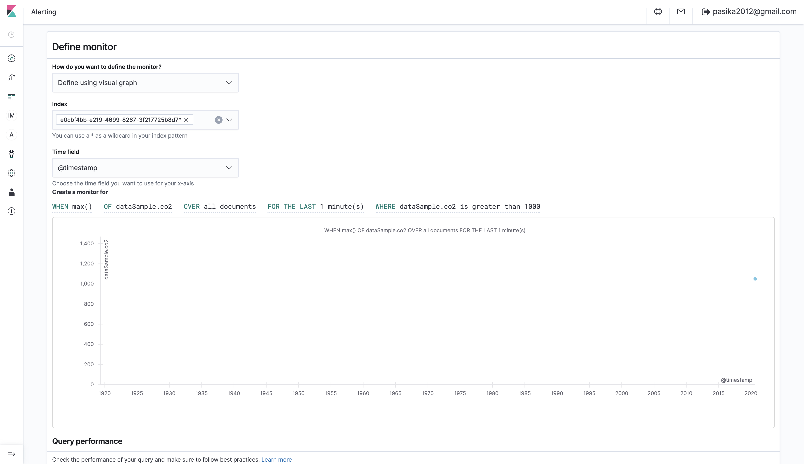
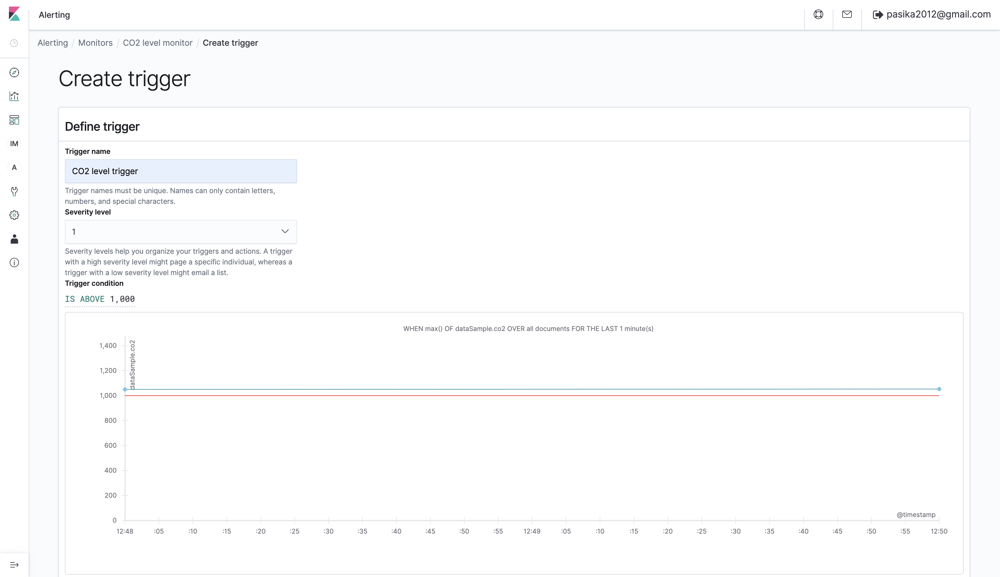
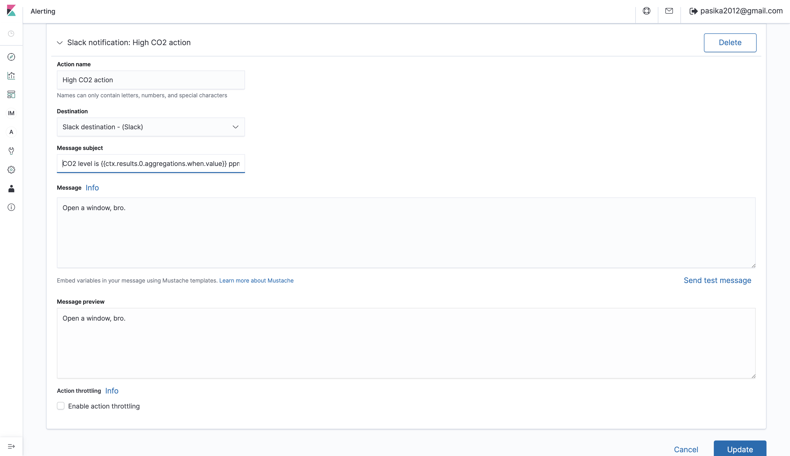
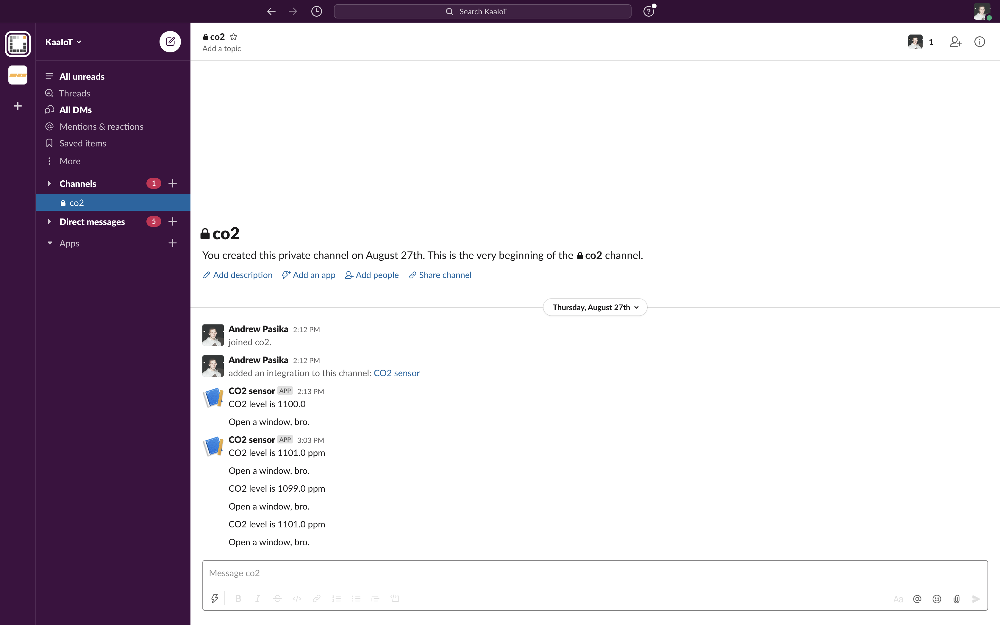
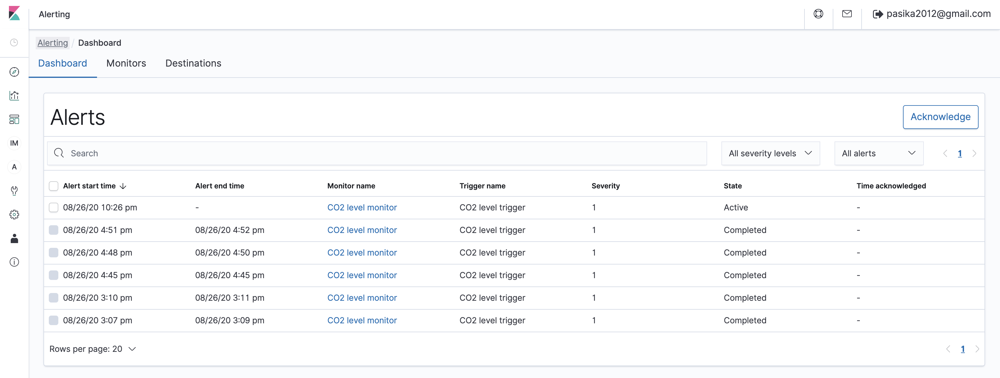




* TOC
{:toc}

Based on the [*Kaa v1.2*][whats new in 1.2].

Time to complete: *10 min*.


## Overview

Welcome to the third tutorial in the Kaa getting started guide!
We assume that you have successfully [connected your first device][connecting your first device] to Kaa and [collected data from a device][collecting data from a device], so make sure to review these tutorials before proceeding here.

From this tutorial you will learn how to configure alerts that will be triggered when certain telemetry value from the endpoint exceeds defined threshold.

In this tutorial we will configure alert that sends Slack notification when CO2 level in office is higher than recommended one.  


## Open Distro integration

Kaa data collection feature is smoothly integrated with [Open Distro][open distro] in such way that all telemetry data coming from your endpoints is automatically get ingested into [Elasticsearch index](https://www.elastic.co/blog/what-is-an-elasticsearch-index) attached to your tenant.

So what is Open Distro?
Open Distro is open source distribution of Elasticsearch with advanced security, alerting, SQL support, automated index management, deep performance analysis, and [more][open distro documentation].


## Playbook

### Push telemetry data

Firstly, we should push telemetry data into Kaa to be able to define Open Distro **monitor**.
For that, execute the below `cURL` replacing `<app-version-name>` and `<endpoint-token>` with your application version name and the endpoint token respectively.

```bash
curl --location --request POST 'https://connect.cloud.kaaiot.com:443/kp1/<app-version-name>/dcx/<endpoint-token>/json' \
--data-raw '[
  {
    "co2": 1050
  }
]'
```


### Create monitor

Now we want to create a **monitor** in Open Distro that will constantly query Elasticsearch index for telemetry coming from an endpoint. 
**Monitor** is a job that runs on a defined schedule and queries Elasticsearch.
The results of these queries are then used as input for one or more **triggers** that we will create a bit later.
More info on Open Distro monitors is [here][create monitor].

Click on "Alerts" on Kaa UI to be redirected to alerts management dashboard in Kibana.


Click "Create monitor".


* Fill out monitor name (e.g., `CO2 level monitor`).
* Select "Define using visual graph" for the "How do you want to define the monitor?" field.
* Fill out index with your tenant ID following by asterisk `*`.
You can find your tenant ID in user account info pop-up on Kaa UI.
The field must look like `{your-tenant-ID}*`.
* Select `@timestamp` time field from dropdown.
* Define the below query for the "Create monitor for" field:

```sql
WHEN count()
OVER all documents
FOR THE LAST 1 minute(s)
WHERE dataSample.co2 is greater than 1000
```

Here we count all documents where `co2` is greater than 1000.



Leave other fields as is and click "Create".


### Create trigger

After monitor creation you should be automatically redirected to the trigger definition page.
Open Distro **triggers** are conditions that, if met, generate alerts and can perform some action.
More info on Open Distro triggers is [here][create trigger].

Give trigger a name (e.g., `CO2 level trigger`); leave severity level as is and define "Trigger condition" as `IS ABOVE 0`.



And click "Create".


### Create destination

Now create a destination that trigger will use when its condition is satisfied.
Destination is a reusable location for an action (will create that guy on the next step), such as Amazon Chime, Slack, or a webhook URL.
More info on Open Distro destinations is [here][create destination].
For destination creation, go to the Alerting dashboard -> Destinations, click "Add destination" button.


Specify name for your destination (e.g., `Slack destination`); select `Slack` for the "Type" field and paste a Slack webhook URL.
Check out [Slack documentation on webhooks][slack webhook]. 


And click "Create".


### Create action

Now we should configure the Open Distro action.
Action is the information that you want the monitor to send out after being triggered. 
Actions have a destination, a message subject, and a message body.
More info on Open Distro actions is [here][create action].

Go back to the "Monitors" page -> click on the just created monitor -> select the trigger -> click "Edit" -> scroll down and click "Add action".
Name the action (e.g., `High CO2 action`), select earlier created destination, enter Message subject (e.g., `High CO2`).
Click "Send test message" and verify that you got notified in Slack.

Now when the action is set up, click "Update".




### Report high CO2 level

Remember that we defined alert to send Slack notification when CO2 level is higher than 1000.
Let's report CO2 equal to 1100 and see what happens.

Simulate a high CO2 level by invoking the next `cURL`.
Don't forget to replace `<app-version-name>` and `<endpoint-token>` with your application version name and the endpoint token respectively.

```bash
curl --location --request POST 'https://connect.cloud.kaaiot.com:443/kp1/<app-version-name>/dcx/<endpoint-token>/json' \
--data-raw '[
  {
    "co2": 1100
  }
]'
``` 

Within one minute you should receive similar notification in your Slack:




### View alerts history

To view alerts history go to the alerting dashboard.




## Learn more

- Check out the webinar where we explained Open Distro analytics and alerts in more details: [Data Analytics and Notifications][webinar Data Analytics and Notifications]
- Learn [Open Distro documentation][open distro documentation] and get deep insights into your IoT data


## Feedback

This tutorial is based on Kaa 1.2 released on July 6-th, 2020.
If you, our reader from the future, spot some major discrepancies with your current version of the Kaa platform, or if anything does not work for you, please [give us a shout][Kaa user chat] and we will help!

Actually, even if the tutorial served you well, we'd love to hear your feedback, so [join the community][Kaa user chat]!

<br/>
<div style="display: flex; justify-content: space-between;">
<div>
<a class="free_trial__button" href="{{sending_commands_to_device}}"><< Sending commands to device</a>
</div>
<div>
<a class="free_trial__button" href="{{custom_web_dashboard}}">Custom web dashboard >></a>
</div>
</div>


[open distro documentation]: https://opendistro.github.io/for-elasticsearch-docs/
[create monitor]: https://opendistro.github.io/for-elasticsearch-docs/docs/alerting/monitors/#create-monitors
[create trigger]: https://opendistro.github.io/for-elasticsearch-docs/docs/alerting/monitors/#create-triggers
[create destination]: https://opendistro.github.io/for-elasticsearch-docs/docs/alerting/monitors/#create-destinations
[create action]: https://opendistro.github.io/for-elasticsearch-docs/docs/alerting/monitors/#add-actions
[slack webhook]: https://api.slack.com/messaging/webhooks
