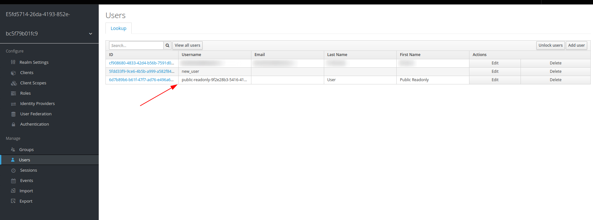
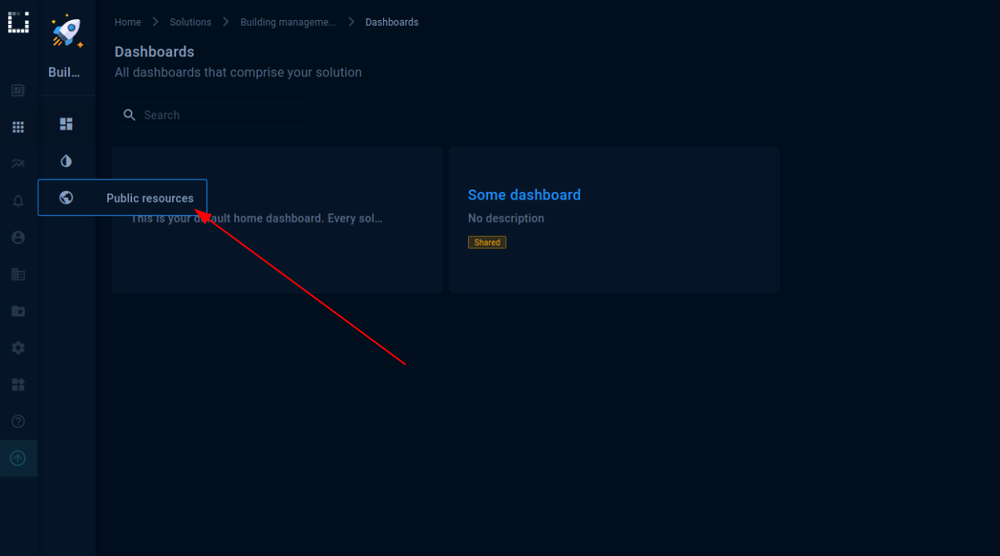
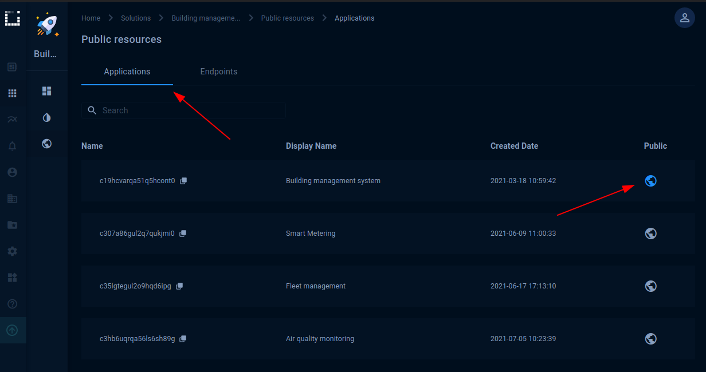
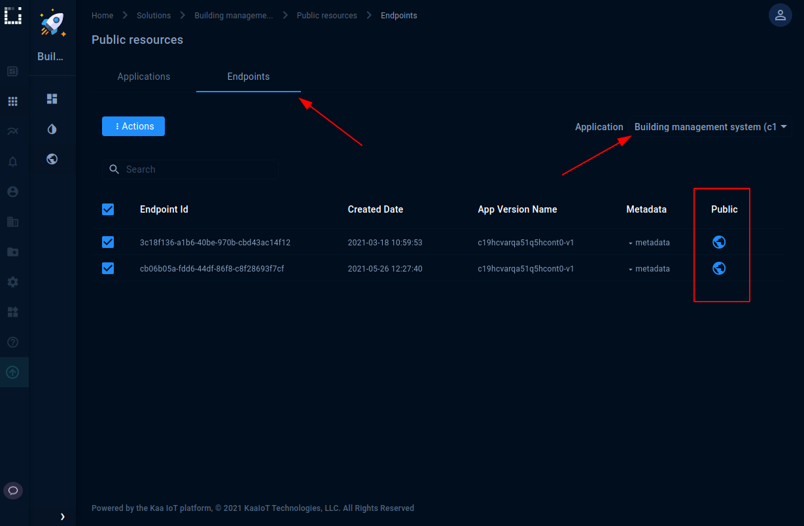
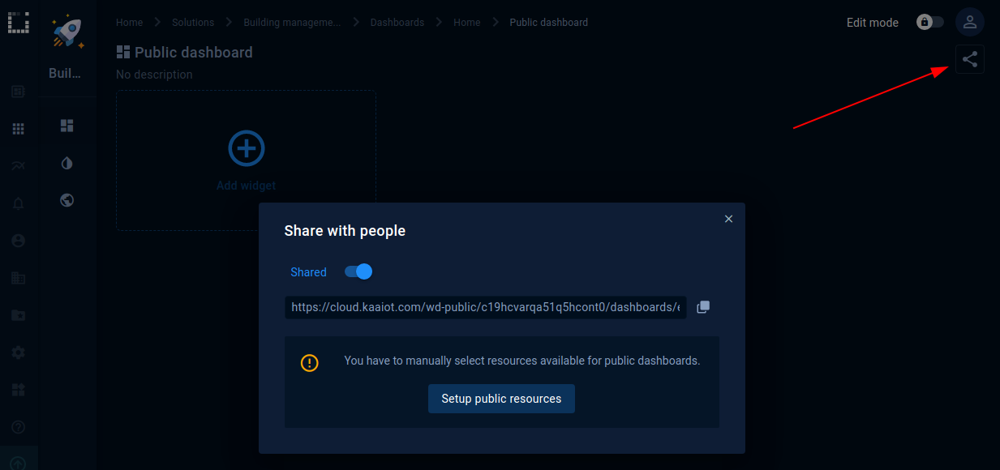
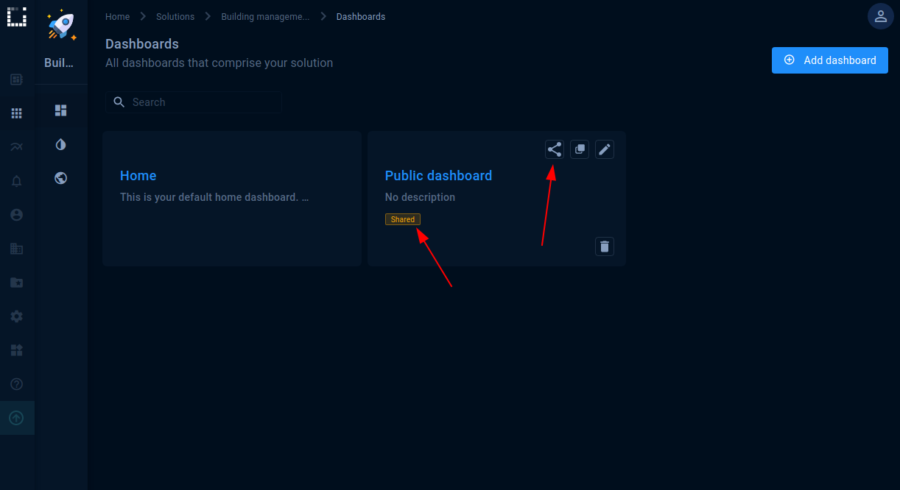
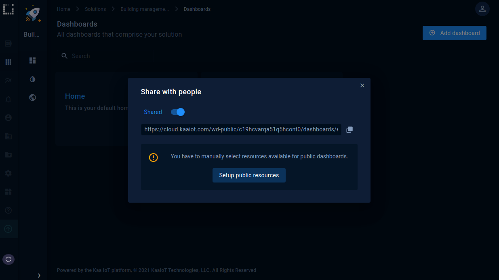
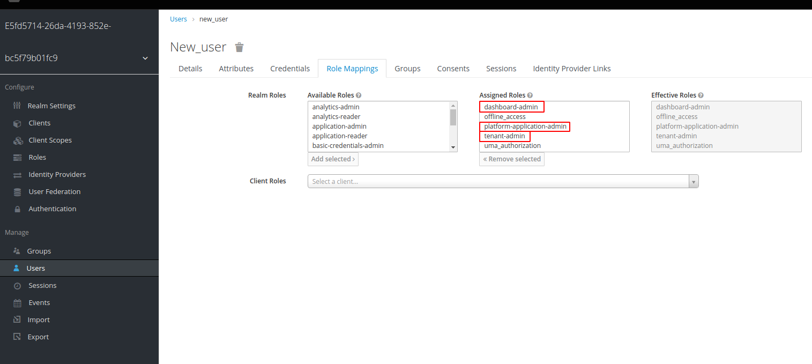
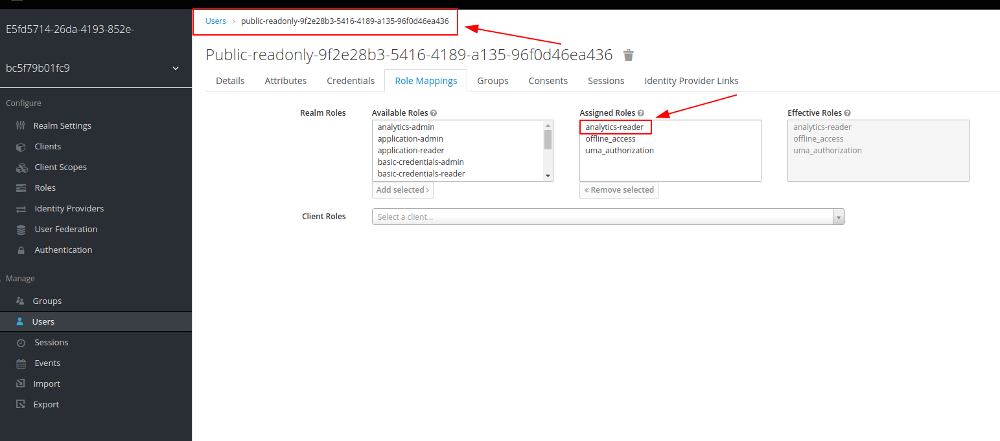




* TOC
{:toc}

## Overview

In this tutorial, you will learn how to create and manage access to public dashboards and share them with other users.

## Prerequisites

To complete this tutorial you need to enable **Advance security configuration** in the Security menu in the Settings tab.
This setting authorizes your tenant administrators to manage all of the tenant security configurations in Keycloak, including:

* add, reconfigure, and remove Keycloak clients
* manage scopes, policies, and permissions

Some of the security configuration changes allowed in the advanced mode may be harmful and lead to the loss of functionality and data access, integration failures, or inability to log into the system.

So be careful since with great power comes great responsibility!

## How it works

So that other users can view your dashboard, you should make it public. Public dashboards become visible to all the users in your tenant or to any user using a special link.

A special public account is created after the first sharing, which gives public permissions to view the resources (in case of our tutorial - dashboards)

You can find the user in Keycloak named as public_<uuid> where uuid is a unique identifier. By default this user doesn't have any platform-specific roles, so he is able to see only public resources. You can provide additional permissions and assign roles to this user if needed. However, we don't recommend assigning any role that allows managing resources like tenant-admin, application-admin, dashboard-admin, analytics-admin, etc. If you need to stop all sharing at once you can just remove this user. A public user can be restored during enable sharing so you don't need to create it manually.

## Playbook 

### Your first public dashboard

Now we can talk about creating the first public dashboard. It is assumed that you already have created a dashboard that you want to share.

* To share the dashboard you need to go to the solutions page, select any of them and go to the **Public resources** page.

* Сhoose the application you want to make public on the **Applications** tab. If your solution uses another application, you also need to share it.

* Select the endpoints you want to make available on the **Endpoints** tab. In order not to display data for some endpoints, you should leave them off.

Sharing setup is done, and your resources are publicly available now.
Also you **should remember** that the solution will become public automatically the first time it is published.
* Now you can share with others the dashboard link either from the solution page or from the specific dashboard you are sharing. Also, please, pay attention that you can see the status of your dashboard on the solution page.

* In case you want to change the status of the shared dashboard or get a link for sharing, click on the sharing icon from the solution page or from the dashboard. Then you will see an additional menu.

### Security roles

To be able to manage the available dashboards and endpoints, you must have one of the following roles for your user in Keycloak:
* platform-admin
* tenant-admin
* dashboard-admin

### Kibana widgets

To view analytics data from the Kibana, having the default roles will not be enough. Kibana widgets require an **analytics-reader** role to display the information.

