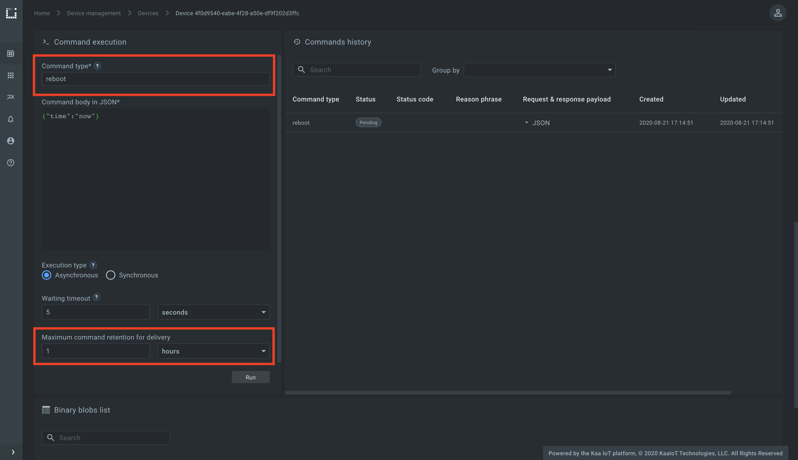
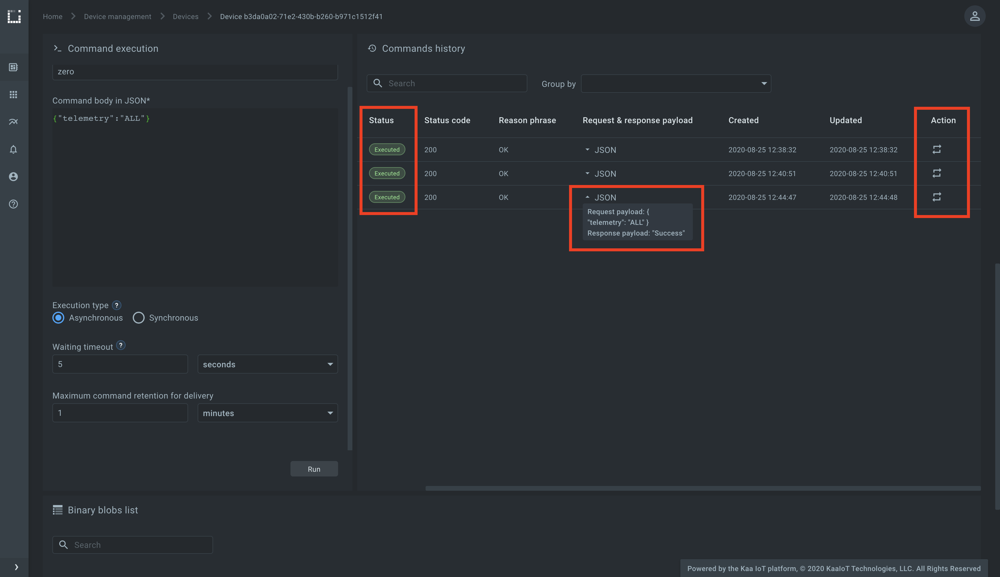




* TOC
{:toc}

Based on the [*Kaa v1.2*][whats new in 1.2].

Time to complete: *8 min*.


<!-- TODO: add video link

<div align="center">
  <iframe width="640" height="385" src="https://www.youtube.com/" frameborder="0"
          allow="accelerometer; autoplay; encrypted-media; gyroscope; picture-in-picture" allowfullscreen></iframe>
</div> --->


## Overview

Welcome to the third tutorial in the Kaa getting started guide!
We assume that you have successfully collected data from your device to Kaa, so make sure to [review the second tutorial][collecting data from a device] before proceeding here.

From this tutorial you will learn some additional concepts of the Kaa platform and discover how to:

* execute commands on your device
* view command execution history on the Kaa UI


## Terms and concepts

Let us start by reviewing some new terms and concepts related to the Kaa command invocation feature.


### Command

**Command** is a short-lived message sent to a connected endpoint from the Kaa platform.
With the commands, you can toggle the light on/off, pop up car trunk, or request an immediate endpoint state report.

Commands may have either *pending* or *executed* states.
*Pending* state means that the command was invoked but no execution result for that command is known yet.
*Executed* state is assigned to the command to which endpoint has respond, meaning an endpoint received the command, executed it, and sent the execution result back to the platform.

Consider the example.

Assume you send a command to your Tesla to park on a parking slot.
The platform immediately assigns *pending* state to that command, your Tesla receives the command and starts parking.
After finishing parking Tesla reports the execution result of that command back to the platform and Kaa assigns *executed* state to that command.

Every command has an execution _status code_ and _reason phrase_ that endpoints can specify at the moment of reporting the execution result back to the platform.
Assuming that your Tesla arrived at the parking slot but it was parked by another vehicle, Tesla may report the execution result specifying `409` status code and some meaningful reason phrase available then from the Kaa UI.


### Command type

**Command type** represents the type of command that you want to execute on an endpoint e.g. `reboot`, `close-door`, `switch-light`, or in the case of Tesla---`park`.
An endpoint can handle as many command types as you define in its firmware.

Now, let's jump into action and do some practice.


## Playbook

We assume that you have already created an application, application version, and endpoint with a token while following the ["connecting your first device" tutorial][connecting your first device].
You can reuse them or create new ones.

Start by logging into your [Kaa Cloud account][Kaa cloud].


### Invoke a command

<ul class="nav nav-tabs">
  <li class="active"><a data-toggle="tab" href="#http-client">HTTP</a></li>
  <li><a data-toggle="tab" href="#mqtt-client">MQTT</a></li>
</ul>

<div class="tab-content"><div id="http-client" class="tab-pane fade in active" markdown="1">

<br>

When a user invokes the command (e.g., from Kaa UI) on the device that connects to the platform over a synchronous protocol (e.g., HTTP) there is no way for the platform to push such command to the device.
Instead, Kaa persists the command and waits till the device requests such command for the execution.
It means that for devices with synchronous protocols it is the their responsibility to periodically poll the platform for new commands.

So let's invoke the command and make it available for the execution by an endpoint.  

Go to the endpoint's dashboard and find the "Command execution" widget.

Fill out _Command type_ field with `reboot` and set _Maximum command retention for delivery_ to 1 hour.
_Maximum command retention for delivery_ defines the time of how long the command is available for the execution by an endpoint.

Click `Run`.



Once the command is invoked, it appears in a response to the polling during the time specified in the _Maximum command retention for delivery_ field (1 hour in our case).

To poll the platform for new commands with the `reboot` command type, execute the bellow `cURL`.
The last part of the URL designates the command type which is `reboot` in our case.

Swap `<app-version-name>` with the application version that endpoint works in and `<endpoint-token>` with an endpoint token.

```bash
curl --location --request POST 'https://connect.cloud.kaaiot.com:443/kp1/<app-version-name>/cex/<endpoint-token>/command/reboot' \
--data-raw '{}'
```

You just retrieved the earlier invoked command.
Capture the `id` from the response.
It's internal **command ID** used by Kaa to uniquely identify the command.

Note that the command is still in the `Pending` state in the "Commands history" widget on Kaa UI.
Let's send command execution result back to Kaa.

Specify application version for `<app-version-name>`, endpoint token for `<endpoint-token>` and command ID for `<command-ID>` from the earlier received response body.

```bash
curl --location --request POST 'https://connect.cloud.kaaiot.com:443/kp1/<app-version-name>/cex/<endpoint-token>/result/reboot' \
--data-raw '[{
    "id": <command-ID>,
    "statusCode": 200,
    "reasonPhrase": "OK",
    "payload": "Success"
}]'
```

When the platform receives the execution result for the command with specific **command ID** it marks the command as **executed** and stops returning it in a response for the command polling.  

<br>

</div><div id="mqtt-client" class="tab-pane fade" markdown="1">

<br>

To run the below MQTT client on your PC, you will need [Python 3][python download] installed.
To speed things up a little, you can also just [open and run it on Repl.it][sending commands to the device repl].

Initialize `ENDPOINT_TOKEN` and `APPLICATION_VERSION` variables with endpoint token and application version respectively.

```python

```

Run the python code.

Now when the simulator is running go to the endpoint's dashboard and send a command with type `zero` to the endpoint.


Navigate to the endpoint `Device telemetry` widget and see that endpoint respond with zero telemetry data values.


<br>

</div></div>

Now repeat the above procedure with any other command specifying custom _Command type_ and _Command body in JSON_.


### Browsing command history

You can browse command history using the `Commands history` widget on Kaa UI.
You can view command status ("Pending" or "Executed"), its request and response payloads, and re-run the command.




## Resources

All the tutorial resources are located on [GitHub][code url].


## Feedback

This tutorial is based on Kaa 1.2 released on July 6-th, 2020.
If you, our reader from the future, spot some major discrepancies with your current version of the Kaa platform, or if anything does not work for you, please [give us a shout][Kaa user chat] and we will help!

Actually, even if the tutorial served you well, we'd love to hear your feedback, so [join the community][Kaa user chat]!

<br/>
<div style="display: flex; justify-content: space-between;">
<div>
<a class="free_trial__button" href="{{collecting_data_from_a_device}}"><< Collecting data from a device</a>
</div>
<div>
<a class="free_trial__button" href="{{open_distro_alerting}}">Open Distro alerting >></a>
</div>
</div>

[code url]: https://github.com/kaaproject/kaa/tree/rel_1.2.0/doc/Tutorials/getting-started/sending-commands-to-your-device/attach/code
