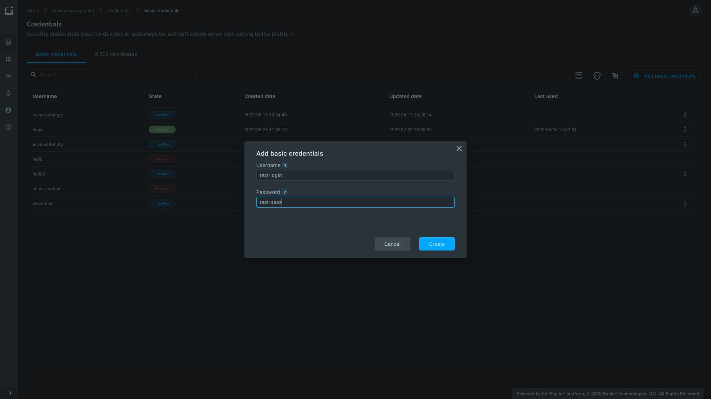
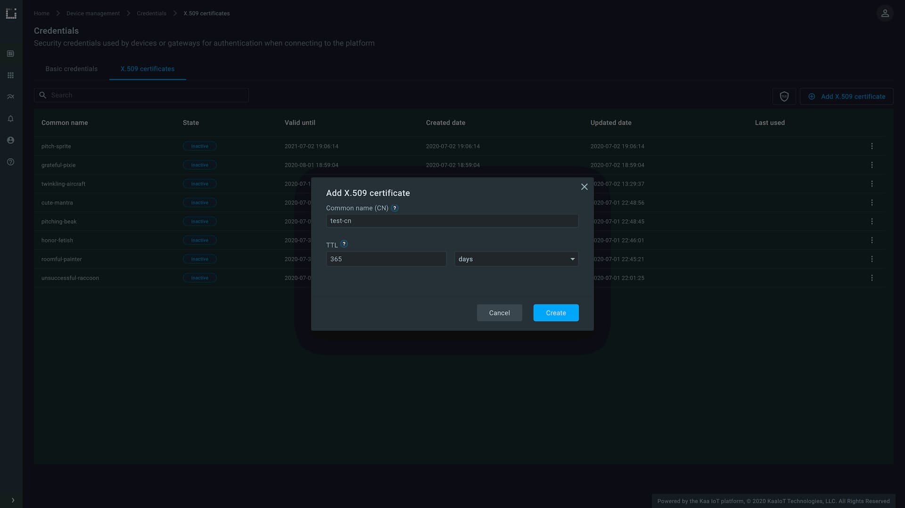
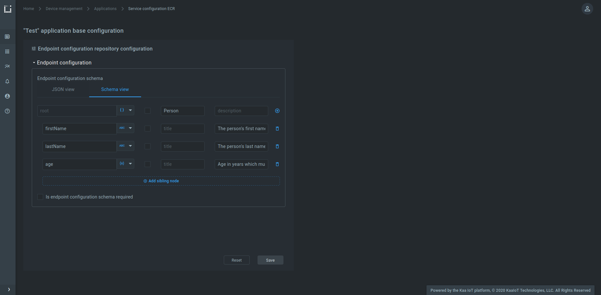
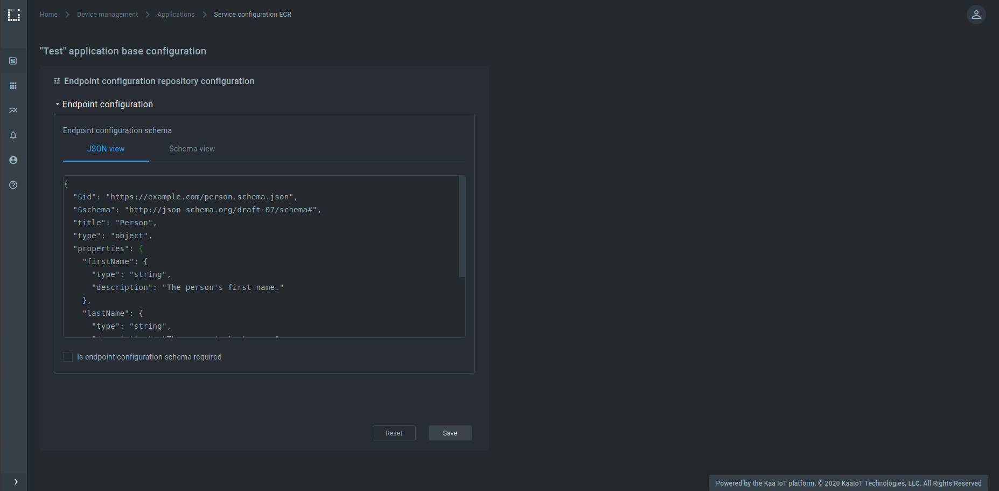
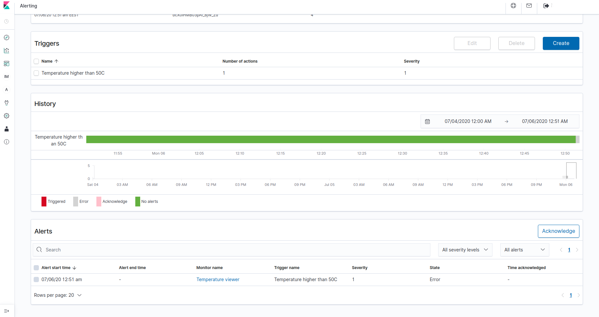




* TOC
{:toc}

## Kaa 1.3

Find below high-level descriptions of some of the major release highlights.

### Other highlights of Kaa 1.3

* [**[CMX]**][CMX] In previous Kaa versions, CMX would send configuration applied messages to the configuration repository, e.g., [ECR][ECR], regardless of whether the config was applied by an endpoint or not.
Starting with Kaa 1.3, CMX no longer automatically sends configuration applied messages.
Instead, CMX sends only those apply messages that were explicitly initiated by an endpoint.

## Kaa 1.2-mr1 (October 2-nd, 2020)
<!-- 1.2.1417 -->

Kaa 1.2-mr1 is a maintenance release for Kaa 1.2 with the following changes:

* **[Bug fix]** Incomplete TLS handshake prevents [KPC][KPC] from accepting other MQTT/TLS connections.
The condition occurs when an outstanding client TLS handshake hangs prior to completion, and clears when the handshake times out.

## Kaa 1.2 (July 6-th, 2020)

Find below high-level descriptions of some of the major release highlights.

### Multi-tenancy

Kaa 1.2 implements an advanced multi-tenancy where every platform tenant is isolated in a dedicated authentication and authorization KeyCloak realm.
Thus, each tenant has a fully isolated space and can manage their own:

* users
* permissions
* applications and their versions
* endpoints and their related data
* client credentials
* solutions
* dashboards, etc.

Tenants are also able to configure their own external Identity Providers (IDPs: e.g. corporate LDAP, Active Directory, various OAuth or SAML providers).

To learn more about multi-tenancy, see [the corresponding documentation][multi-tenancy].

### Client credentials management

[**Client Credentials Management service (CCM)**][CCM] is a new Kaa service for the [client][client] authentication that takes over these responsibilities from the [**Credentials Management service (CM)**][CM].
CCM supports authentication using basic credentials, like username/password, and SSL/TLS certificates, based on X.509 technology.

Basic authentication is currently supported by all MQTT-based transports available in the [Kaa Protocol Communication service (KPC)][KPC]: plain MQTT, MQTT/TLS, MQTT/WebSocket.
X.509 authentication is supported by the MQTT/TLS KPC transport.

Both basic and X.509 authentication are now enforcable on a per-tenant basic, separately for each compatible transport.
You can toggle them in your tenant right from the [Kaa Web Dashboard][WD] interface.

Kaa WD now also provides interface for managing basic and X.509 credentials.
Credentials of both types are a propery of a given tenant and can be used to connect clients to exchange data on behalf of any endpoints that belong to applications of that tenant.

Basic credentials management.

X.509 credentials management.

### HTTP transport support

[**Kaa Protocol Communication service (KPC)**][KPC] now supports [HTTP transport][KPC HTTP] that implements [1/KP protocol][1/KP] over plain HTTP.
Unlike 1/KP over MQTT, HTTP binding is synchronous: it follows the request-response communication pattern and does not support server message push.

Learn more about integrating clients using the HTTP transport [here][1/KP over HTTP].

### Binary data collection

Kaa 1.2 supports collection of binary data blobs (still images, video segments, audio recordings, etc.) from connected devices.
This is enabled by a new microservice: [**Binary data Collection Extension (BCX)**][BCX].
The supported data storage backend is AWS S3.

To upload a binary data blob, client must first [retrieve a temporary authorization token][BCX token exchange extension interface] on behalf of an endpoint from the BCX service using an existing communication channel (MQTT- or HTTP-based).
Once in possession of a temporary token, client may upload binary data blobs related to that endpoint using the [RESTful data upload API][BCX binary data blob upload REST API].
BCX also provides [REST API for managing and accessing already uploaded binary blobs][BCX data blob management REST API].

The submitted binary data blobs can be viewed and downloaded using corresponding Kaa Web Dashboard (WD) widgets:

### Endpoint configuration schema management

In Kaa 1.0 and 1.1 endpoint configuration was a free-form JSON document.
With Kaa 1.2 we introduce an ability to configure endpoint configuration schema in the [Endpoint Configuration Registry service (ECR)][ECR].
The endpoint configuration schemas are associated with Kaa applications and appversions.
The appversion-specific schema takes precedence over the corresponding application-specific schema.

When schema validation is enabled in ECR, it rejects provisioning endpoint configs that do not satisfy the expected schema.

Endpoint configuration schemas can be configured for ECR in the Kaa Web Dashboard, either in the schema view:

or in the JSON view:

### Data samples enrichment with endpoint metadata

Kaa [Data Collection Extension service (DCX)][DCX] now supports enriching data samples received from connected endpoints with their metadata attributes.
When this feature is [enabled in the DCX configuration][DCX metadata enrichment config], it appends endpoint metadata key-value pairs to each data sample events using the specified path (`~ep-metadata` by default).
Doing so makes it possible to feed downstream data processing services, such as [EPTS][EPTS] or [KDCA][KDCA] with additional endpoint-related state information.
Note that only data samples that are JSON objects can be enriched with endpoint metadata.
The data samples enrichment is disabled by default for backward compatibility.

See the [DCX documentation][DCX metadata enrichment] for more details.

### Data analytics

Kaa 1.2 is now pre-integrated out of the box with the [Open Distro for Elasticsearch][open distro].
Each tenant's data is isolated in Elasticsearch and Kibana, and the security access policies are seamlessly integrated with Kaa.
This integration enables various IoT data analytics functionality, including collection, analysis, querting and visualizing device data.

Flexible triggers and alerts can be configured to send notifications to preferred destinations.

Find out more about the data analytics in Kaa [here][data analytics].

### Other highlights of Kaa 1.2

* [**[TEKTON]**][TEKTON] Tekton now restricts the application version name suffix to match `^[a-z0-9]+$` regex pattern when you create a new application version using the [REST API][TEKTON app version create REST API].
  In addition, application names will be automatically generated for [newly created applications][TEKTON application create REST API] when `kaa.tekton.app-names.auto-generation.enabled` configuration variable is set to `true`.
  It is recommended to enable the auto-generation to prevent the possible [application name conflicts](#application-and-application-version-names-conflict-in-java-based-services).
* [**[TEKTON]**][TEKTON] Tekton now supports bulk REST API for [Bulk operations][TEKTON bulk REST API] on tenants and their applications.
* [**[CEX]**][CEX] `commandRetentionTtl` time unit changed in [REST API][CEX REST API POST command] from hours to milliseconds.
* [**[CEX]**][CEX] `commandRetentionTtl` renamed in [REST API][CEX REST API POST command] to `commandTtl`.
* [**[EPTS]**][EPTS] EPTS now supports updating time series data for specified endpoints under application version in its [REST API][EPTS time series PUT via app version REST API].
  Just like with DSTP and TSTP interfaces, the data points published to this API yield time series events on the TSTP interface.
* [**[EPTS]**][EPTS] REST API for [updating endpoint time series data under an application][EPTS time series PUT REST API] is deprecated and will be dropped in the next release.
  Using the [application version-specific API][EPTS time series PUT via app version REST API] instead is recommended going forward.
* [**[EPTS]**][EPTS] EPTS now supports defining which of the `fromDate` and `toDate` are inclusive when [retrieving historical time series data][EPTS time series data REST API].
* [**[EPTS]**][EPTS] EPTS now supports data points filtering using the `beforeDate` query parameter in its [REST API][EPTS time series last REST API].
* [**[EPR]**][EPR] In previous Kaa versions EPR provided endpoint metadata and endpoint filter management only via its [REST API][EPR REST API].
  Now, in addition to REST API it is possible to manage endpoint [metadata][endpoint-metadata] and [endpoint filters][endpoint-filter] via [NATS][nats] using the [19/EPMMP] and [20/EFMP] protocols.
  These interfaces improve overall performance and give more flexibility in platform expansion and customization.
* [**[CEX]**][CEX] now supports getting the list of existing command resources per endpoint or application name via the [REST API][CEX REST API].
* [**[CEX]**][CEX] now uses PostgresSQL database instead of Redis.
* [**[ECR]**][ECR] configuration response format changed in [default config API][ECR REST API GET default config] and [per-endpoint config API][ECR REST API GET per-endpoint config].
* [**[ECR]**][ECR] `/endpoints/{endpointId}/app-versions/{appVersionName}/current` REST endpoint removed.
  Use [per-endpoint config API][CEX REST API GET per-endpoint config] instead.
* **[RCI]** service is now fully deprecated and removed.
  [CEX][CEX] service provides a super-set of the original RCI functionality.
* [**[KDCA]**][KDCA] now adds tenant ID and the endpoint application version fields to Kafka events.
* [**[CMX]**][CMX] now supports configuration applied messages from endpoints per [7/CMP][7/CMP].
* [**[WD]**][WD] JSON schema editor integrated with Configuration form, Endpoint list, Software OTA related widgets.
* [**[WD]**][WD] New widgets added: "Device orientation" and "Luminance".
* [**[WD]**][WD] Added dynamic variables for "Gauge" widgets.
  It is possible to populate values from endpoint or application version configuration to scale, max, min and threshold fields.
* [**[WD]**][WD] "Multi series chart" now can be configured to show mixed line styles like bar, step and line.
  It is now possible to show data from multiple endpoints.
* [**[WD]**][WD] now has a pre-configured device management page for manage endpoint metadata, commands, data blobs, etc.
* [**[WD]**][WD] now has a "User management" link that redirects to the KeyCloak user administration page.
* [**[WD]**][WD] now has a "Help" page.
* [**[WD]**][WD] various UX improvements, performance optimizations, and bugfixes.
* **[Bug fix]** [KPC][KPC] sets SubAck MQTT packet QoS.
* **[Bug fix]** [KDCA][KDCA] does not recover after losing a Kafka connection.
* **[Bug fix]** Java services don't fetch Tekton configs at boot time.

## Kaa 1.1-mr3 (November 17-th, 2020)

Kaa 1.1-mr3 is a maintenance release for Kaa 1.1 with the following changes:

* **[Bug fix]** `commandRetentionTtl` zero value in [REST API][https://docs.kaaiot.io/KAA/docs/v1.1.0/Features/Command-invocation/CEX/REST-API/#endpoints__endpointid__commands__commandtype__post] was not supported.
Now commands with zero `commandRetentionTtl` are pushed to the device only once.
Also, `commandRetentionTtl` can be configured with `kaa.cex.commands.command-retention-ttl-hours` service configuration property.

## Kaa 1.1-mr2 (October 2-nd, 2020)
<!-- 1.1.119 -->

Kaa 1.1-mr2 is a maintenance release for Kaa 1.1 with the following changes:

* **[Bug fix]** Incomplete TLS handshake prevents [KPC][KPC] from accepting other MQTT/TLS connections.
The condition occurs when an outstanding client TLS handshake hangs prior to completion, and clears when the handshake times out.

## Kaa 1.1-mr1 (March 25-th, 2020)
<!-- 1.1.110 -->

Kaa 1.1-mr1 is a maintenance release for Kaa 1.1.
In scope of this release the following changes were made:

* **[Bug fix]** Creating a new application or application version overwrites configuration of an existing one.
Reproducible with Java-based services when the new name is a sub-string of an existing one.
* **[Bug fix]** The [WD][WD] permits creating endpoints with an empty token.
* **[Bug fix]** The [WD][WD] does not render variables in dashboard titles.
* **[Bug fix]** Wrong [WD][WD] documentation link anchors.

### Known issues in Kaa 1.1-mr1

#### Application and application version names conflict in Java-based services

**Affected Kaa versions**: [1.1-mr1](#kaa-11-mr1-march-25-th-2020), [1.1](#kaa-11-november-8-th-2019), and [1.0](#kaa-10-june-10-th-2019).

**Issue summary**: Application or application version names that differ only by dashes (`-`) or underscores (`_`) cause naming conflict in Java-based services.

Consider an example of a Kaa application with name `smart_kettle`.
Creating applications with names like `smart-kettle`, `smartkettle`, or similar, will cause a conflict when loading such configuration in Java-based services.

To prevent this issue, starting from [Kaa 1.2](#kaa-12-future-release) we introduced the option of application name auto-generation on [creation via the Tekton REST API][TEKTON application create REST API].
Additionally, the application version name suffix is restricted to lowercase Latin letters (`a-z`) and digits (`0-9`) when you [create new application versions][TEKTON app version create REST API].

**Known workaround**: To prevent the issue from happening in affected Kaa versions, refrain from creating applications or application versions with names that only differ by dashes (`-`) or underscores (`_`).
Starting with [Kaa 1.2](#kaa-12-future-release) it is recommended to enable the application name auto-generation feature.

## Kaa 1.1 (November 8-th, 2019)
<!-- 1.1.77 -->

Find below high-level descriptions of some of the major release highlights.

### Kaa Tekton

[Kaa Tekton][TEKTON] is a new Kaa infrastructure component that takes ownership of the Kaa [applications, application versions][application], and the application-specific configurations for [Kaa service instances][scalability].
In previous Kaa versions applications and their configurations were defined in the configuration files of each Kaa microservice.
Such configuration is still supported for backward compatibility and simple deployments.
However, Tekton now offers a more convenient management mechanism.

Tekton exposes [REST API][TEKTON REST API] for managing applications, versions, and the associated configurations.
The [Web Dashboard (WD)][WD] leverages this API and provides a convenient management UI.
Applications are represented as [protected resources][application resource type] in the auth server, so you can configure users' level of access by granting corresponding [OAuth 2.0 scopes][oauth scope].

Whenever the list of applications, versions, or service configs changes, Tekton generates an appropriate [17/SCMP][17/SCMP] notification message over NATS that gets delivered to all affected service replicas.
In turn, they reload updated configurations from Tekton and apply changes immediately without a restart.
It is no longer necessary to update all service instance configuration files or reboot service replicas.

You can use [this script](https://github.com/kaaproject/kaa/blob/master/doc/Whats-new/attach/v1.1/generate_tekton_config.py) to convert your Kaa 1.0 blueprint configuration files into a JSON suitable for [Tekton bulk configuration load REST API][TEKTON bulk config load REST API].
Note that due to the various compatibility reasons the application and application version names must be limited to lowercase latin letters (`a-z`), digits (`0-9`), dashes (`-`) and underscores (`_`).

### Unified resource naming convention

The Kaa platform uses [OAuth 2.0][oauth2] and [User-Managed Access (UMA)][uma] for API calls authentication and authorization.
Starting with Kaa 1.1 all Kaa components follow a [unified resource naming convention][api security] that is designed to prevent naming conflicts.
Users upgrading from Kaa 1.0 must rename resources in their auth servers according to the new convention.

### Web Dashboard theme customization

Previously, the Web Dashboard theme customization was possible via loading custom CSS.
In Kaa 1.1 the primary UI colors were revised and consolidated, and the theme customization is now possible right from the Administration page.

### Other highlights of Kaa 1.1

* [**[CEX]**][CEX] CEX now supports synchronous and asynchronous [REST API][CEX REST API] calls for command invocation.
  Due to this, the [RCI][RCI] microservice is now deprecated and will be retired in a future Kaa version.
* [**[CEX]**][CEX] In previous Kaa versions CEX would send new commands asynchronously to any connected endpoint.
  Starting with Kaa 1.1, according to [11/CEP][11/CEP] protocol, CEX no longer would send new commands asynchronously after the endpoint sends a command request message with `observe` flag explicitly set to `false`.
* [**[CMX]**][CMX] In previous Kaa versions CMX would send new configurations asynchronously to any connected endpoint.
  Starting with Kaa 1.1, according to [7/CMP][7/CMP] protocol, CMX no longer would send new configurations asynchronously after the endpoint sends a configuration request message with `observe` flag explicitly set to `false`.
* [**[EPTS]**][EPTS] [Auto-extracted time series][EPTS time series auto extraction] now have `auto~` prefix to prevent name conflicts with user configured time series.
* [**[EPTS]**][EPTS] Support for saving time series data via the [EPTS REST API][EPTS time series PUT REST API].
* [**[EPTS]**][EPTS] Support for storing and retrieving [time series data with explicit `null` values][EPTS time series extraction].
* [**[EPTS]**][EPTS] User configured time series names are now limited to a combination of lowercase latin letters (`a-z`), digits (`0-9`), dashes (`-`) and underscores (`_`).
* [**[CM]**][CM] REST API [OAuth 2.0 scopes][oauth scope] for [client credential and certificate management][CM clients REST API] changed to `kaa:client-credentials:read`, `kaa:client-credentials:create`, `kaa:client-credentials:update`, `kaa:client-certificates:read`, `kaa:client-certificates:create`, and `kaa:client-certificates:update`.
* [**[CM]**][CM] CM now only accepts x.509 cert serial number in base 10 encoding on provisioning and validation.
  Also, a specific list of x.509 cert issuer fields processed by CM is restricted and documented [here][CM certificate POST REST API].
  Active x.509 client certificates must be re-provisioned into CM.
* [**[EPR]**][EPR] EPR no longer supports `GET /applications` and `GET /applications/{applicationName}` REST API calls.
  The API for retreving application information is now [available from Tekton][TEKTON applications REST API].
* [**[EPR]**][EPR] EPR now supports creating endpoints with [user-defined endpoint IDs][EPR endpoint POST REST API].
  Such IDs must match `^[a-zA-Z0-9._~-]+$` regex pattern.
  This is useful for matching entities between Kaa and external systems.
* [**[KPC]**][KPC] KPC now always observes the MQTT keepalive interval set by the client in the CONNECT packet.
* [**[KPC]**][KPC] Support for [endpoint][endpoint] roaming across [client][client] MQTT connections to different KPC replicas.
  When multiple gateways (Kaa clients) represent a single endpoint, they may communicate on behalf of such endpoint in turns.
  Whenever such communication switch (roaming) occurs, even across KPC replicas, they are now able to identify that and correctly remove endpoint from the routing table of the previously used KPC replica.
* [**[WD]**][WD] Default "Device management" and "Software management" pages are now available in WD to administrators with `application:update` OAuth 2.0 scope granted for a given Kaa application.
* [**[WD]**][WD] Added the ability to specify the default sort key and direction in endpoint list and time series table widgets.
* Documentation restructuring: previously Kaa components documentation was hosted separately from the general documentation.
  For the readers' convenience, all component docs are now relocated to the ["Features and components" section][kaa features].
  This documentation now captures the exact state of all platform components at the moment of the general platform release.
  You can refer to the "Components" subsection of each feature page to find out the specific service versions included in a given release.
  For example, see the ["Device management" feature page](../Features/Device-management/#components).
* Multiple performance optimizations, usability and visual improvements, and bug fixes.

## Kaa 1.0 (June 10-th, 2019)

Kaa 1.0 is the initial general release of the Kaa Enterprise IoT platform.

Prior to the 1.0 version, every Kaa component was versioned independently.
Such independent versioning still exists for each of the Kaa microservices, while the Kaa 1.0 release is a "meta-package" that includes a set of component versions.
All of the microservices in Kaa 1.0 have been tested for interoperation and can be installed in one shot to a Kubernetes cluster of your choice with a new Kaa installer.
